# Detailed BRD Agent Execution Workflow

This document models the **actual implemented execution workflow** of the BRD Lead Agent subsystem in `backend/src/agents/brd/agent.py` and its interacting components (`api/conversations.py`, `BRDEvaluationAgent`, `BRDSectionGenerationAgent`, `BRDSectionValidationAgent`, `BRDFinalValidationAgent`, `RAGService`, and `BRDAgentState`).

---

## 1. Mermaid Workflow

```mermaid
flowchart TD
    %% Entry Point and Context Reconstruction
    Start([User Message Received]) --> API_Entry["API Layer: Extract Tenant Context & Persist User Message Turn"]
    API_Entry --> State_Restore["Reconstruct Durable Workflow State from Prior Message Metadata"]
    State_Restore --> Ev_Ingest["Ingest User Message as Authoritative Evidence<br/><i>(Exclude Assistant Turns)</i>"]
    
    %% Phase 1: Context & Objective Initialization
    Ev_Ingest --> P1_Init["Phase 1: Context & Objective Initialization<br/><i>(Resolve Project Context, Active Objective & Template Sections)</i>"]
    P1_Init --> Check_RAG{"Is Project RAG<br/>Capability Equipped?"}
    
    Check_RAG -- No --> Err_NoRAG(["Halt: Error - RAG Unavailable for Grounded BRD Generation"])
    Check_RAG -- Yes --> Check_Resume{"Is Conversation<br/>Resuming from Clarification?"}
    
    %% Resumption Branches
    Check_Resume -- "Yes: Consolidated Clarification" --> Res_Consolidated["Incorporate Clarification into State Evidence"]
    Res_Consolidated --> Res_UpdateSecs["Update Affected Sections via Section Generator<br/>& Re-validate via Section Validator"]
    Res_UpdateSecs --> Res_ClearGaps["Clear Unresolved Information & Waiting Flag"]
    Res_ClearGaps --> P6_Gate
    
    Check_Resume -- "Yes: Section-Specific Clarification" --> Res_Section["Incorporate Clarification into State Evidence<br/>& Restore Pending Current Section"]
    Res_Section --> P5_SecLoop
    
    Check_Resume -- "No: Initial Execution" --> P2_ActionDecision
    
    %% Phase 2: Action Decision
    subgraph Phase2 ["Phase 2: Action Decision (Lead Agent Intelligence)"]
        P2_ActionDecision["Analyze Objective & Project Metadata with LLM"]
        P2_ActionDecision --> Decide_Action{"Decide Action Type"}
    end
    
    %% Phase 3: Action Execution
    subgraph Phase3 ["Phase 3: Action Execution"]
        Decide_Action -- "RAG" --> Exec_RAG["Execute search_project_knowledge Tool<br/>Store Retrieved Evidence in State"]
        Decide_Action -- "DELEGATION" --> Exec_Delegation["Decompose into DelegatedTasks<br/>Execute Temporary Sub-Agents & Collect Results"]
        Decide_Action -- "DIRECT_WORK" --> Exec_DirectWork["Perform Direct Analytical Synthesis<br/>Store in Agent Work State"]
    end
    
    Exec_RAG --> P4_Eval
    Exec_Delegation --> P4_Eval
    Exec_DirectWork --> P4_Eval
    
    %% Phase 4: Evidence Evaluation & Interpretation
    subgraph Phase4 ["Phase 4: Evidence Evaluation & Lead Agent Interpretation"]
        P4_Eval["Invoke Evaluation Sub-Agent (BRDEvaluationAgent)<br/><i>(Tool-less Categorical Evidence Evaluation)</i>"]
        P4_Eval --> Eval_Outcome{"Evaluation Outcome?"}
        
        Eval_Outcome -- "SUFFICIENT" --> P4_Proceed["Gap Decision: PROCEED_TO_SECTION_GENERATION"]
        
        Eval_Outcome -- "INSUFFICIENT" --> P4_Interpret["Lead Agent Interprets Gaps & Distinguishes<br/>User Decisions vs Document Specifications"]
        P4_Interpret --> Gap_Resolution{"Gap Resolution Strategy"}
        
        Gap_Resolution -- "ASK_USER (User Decisions / Budget / Approvals)" --> Pause_UserClarify(["Pause Workflow: Set Waiting For User<br/>Emit Clarification Question"])
        
        Gap_Resolution -- "RAG (Document Specs)" --> P4_RAGRetry["Execute RAG Search Retry & Re-evaluate Evidence"]
        P4_RAGRetry --> ReEval_Check{"Re-evaluation Outcome?"}
        ReEval_Check -- "SUFFICIENT" --> P4_Proceed
        ReEval_Check -- "Still INSUFFICIENT" --> P4_RecordGaps["Record Substantive Gaps in State unresolved_information<br/>Proceed with Best Available Evidence"]
        P4_RecordGaps --> P4_Proceed
    end
    
    P4_Proceed --> P5_InitProgression["Initialize Section Progression at Section 1 (Template Order)"]
    
    %% Phase 5: Section Iteration Loop
    subgraph Phase5 ["Phase 5: Section Iteration Loop (Sequential Processing across Template Sections)"]
        P5_InitProgression --> P5_SecLoop{"All Sections Completed?"}
        P5_SecLoop -- "Yes" --> P6_Gate
        P5_SecLoop -- "No (Process Current Section)" --> Check_Admin{"Is Section Administrative?<br/><i>(Header, Version History, Quality Gate)</i>"}
        
        Check_Admin -- "No: Domain Section" --> P5_RAG["Retrieve Section-Specific Project Evidence via RAG<br/><i>(Driven by Template Requirements & Cache Check)</i>"]
        Check_Admin -- "Yes: Administrative" --> P5_Gen
        P5_RAG --> P5_Gen
        
        P5_Gen["Invoke Section Generation Sub-Agent (BRDSectionGenerationAgent)<br/><i>(Generate Initial Section Markdown adhering to Template)</i>"]
        P5_Gen --> P5_Val["Invoke Section Validation Sub-Agent (BRDSectionValidationAgent)<br/><i>(Evaluate 7 Quality & Grounding Categories)</i>"]
        
        P5_Val --> P5_LeadInterpret["Lead Agent Interprets Validation Findings<br/><i>(Filter Benign Metadata TBDs & Doc-Quality Observations)</i>"]
        P5_LeadInterpret --> Sec_Valid{"Section Valid?"}
        
        %% Valid Progression
        Sec_Valid -- "Yes: VALID" --> P5_MarkDone["Mark Section Status COMPLETED<br/>Advance to Next Section in Template Order"]
        P5_MarkDone --> P5_SecLoop
        
        %% Bounded Rework Loop (Max 2 Attempts)
        Sec_Valid -- "No: NEEDS_REWORK" --> Rework_Loop{"Rework Attempts < 2?"}
        
        Rework_Loop -- "Yes: Attempt Rework" --> Check_ReworkRAG{"Requires Additional<br/>RAG Evidence?"}
        Check_ReworkRAG -- "Yes" --> Rework_FetchRAG["Retrieve Missing Evidence via Targeted RAG Query"]
        Check_ReworkRAG -- "No" --> Rework_Update
        Rework_FetchRAG --> Rework_Update
        
        Rework_Update["Invoke Section Generation Sub-Agent (Operation: UPDATE)<br/><i>(Apply Guidance & Refine Existing Content)</i>"]
        Rework_Update --> Rework_Reval["Invoke Section Validation Sub-Agent<br/><i>(Re-validate Section Content)</i>"]
        Rework_Reval --> Rework_Reinterpret["Lead Agent Interprets Validation Findings"]
        Rework_Reinterpret --> Rework_CheckValid{"Valid After Rework?"}
        
        Rework_CheckValid -- "Yes" --> P5_MarkDone
        Rework_CheckValid -- "No" --> Rework_Loop
        
        %% Rework Limit Exhausted Handling (DEF-011)
        Rework_Loop -- "No: Rework Exhausted (2 Attempts)" --> Classify_Failure{"Classify Failure Category"}
        
        Classify_Failure -- "EVIDENCE_GAP" --> Check_Consolidate{"Consolidate Clarification Enabled?<br/><i>(Default: True)</i>"}
        
        Check_Consolidate -- "Yes (Consolidate)" --> Gap_PreserveDraft["Record Genuine Gaps in unresolved_information<br/>Preserve Draft Content & Mark Section COMPLETED"]
        Gap_PreserveDraft --> Check_HasNext{"Has Next Section?"}
        Check_HasNext -- "Yes" --> P5_AdvNext["Advance to Next Section in Template Order"] --> P5_SecLoop
        Check_HasNext -- "No (Last Section)" --> P6_Gate
        
        Check_Consolidate -- "No (Immediate)" --> Check_SecClarified{"Clarification Already<br/>Attempted for Section?"}
        Check_SecClarified -- "No" --> Sec_AskUser(["Pause Workflow: Mark NEEDS_REVISION<br/>Emit Section Clarification Question"])
        Check_SecClarified -- "Yes" --> Sec_FailDiag
        
        Classify_Failure -- "GENERATION_QUALITY / TEMPLATE_CONFIGURATION" --> Sec_FailDiag["Format Diagnostic Failure Report<br/>Mark Section Status NEEDS_REVISION"]
        Sec_FailDiag --> Sec_Halt(["Halt Workflow: Return Diagnostic Failure Response (success=False)"])
    end
    
    %% Phase 6: Document Assembly Gate
    subgraph Phase6 ["Phase 6: Document Assembly Gate"]
        P6_Gate{"Verify All Template Sections<br/>are COMPLETED"}
        P6_Gate -- "Incomplete" --> Pause_Incomplete(["Pause Workflow: Sections Incomplete"])
        P6_Gate -- "All Completed" --> Assemble_Doc["Deterministic Document Assembly<br/><i>(Merge validated sections in exact template order, preserve headers/tables)</i>"]
        Assemble_Doc --> Store_Assembled["Store Complete BRD in State assembled_brd"]
    end
    
    Store_Assembled --> P7_FinalVal
    
    %% Phase 7 & 8: Final Validation & BRD Rewriter Workflow
    subgraph Phase78 ["Phase 7 & 8: Document Final Validation & BRD Rewriter (Single-Pass Correction Cycle)"]
        P7_FinalVal["Phase 7: Final Validation Sub-Agent (Pass 1)<br/><i>(Whole-document evaluation across cross-section & consistency dimensions)</i>"]
        P7_FinalVal --> FinalVal_Check{"Pass 1 Valid?"}
        
        FinalVal_Check -- "VALID" --> P9_Comp
        
        FinalVal_Check -- "NEEDS_REWORK" --> P8_Rewriter["Phase 8: BRD Rewriter Sub-Agent (BRDRewriterAgent)<br/><i>(Targeted minimal edits in a single operation; tools=[])</i>"]
        P8_Rewriter --> P8_ApplyEdits["Apply DocumentEdits to assembled_brd<br/>Synchronize section content downstream for state persistence"]
        P8_ApplyEdits --> P7_Pass2["Phase 7: Final Validation Sub-Agent (Pass 2)<br/><i>(Re-validate assembled document against findings)</i>"]
        P7_Pass2 --> Pass2_Check{"Pass 2 Valid?"}
        
        Pass2_Check -- "VALID" --> P9_Comp
        Pass2_Check -- "NEEDS_REWORK" --> P8_TerminalGaps["Terminate Correction Cycle Immediately<br/>Convert unresolved findings into ## Open Questions / Clarifications<br/>Append section to assembled_brd in state"]
        P8_TerminalGaps --> P9_Comp
    end
    
    %% Phase 9: Completion & Response
    subgraph Phase9 ["Phase 9: Workflow Completion & Normalized Response"]
        P9_Comp["Prepare Assembled BRD Document"]
        P9_Comp --> Check_Unresolved{"Substantive Gaps in unresolved_information<br/>AND Clarification Gate Not Run?"}
        
        Check_Unresolved -- "Yes" --> Build_ConsolidatedQ["Construct Consolidated Numbered Clarification Questions<br/>Append Questions below Assembled Document<br/>Set pending_consolidated_clarification & waiting_for_user"]
        Build_ConsolidatedQ --> Return_Response
        
        Check_Unresolved -- "No" --> Finalize_Doc["Finalize Assembled Document without Additional Questions"]
        Finalize_Doc --> Return_Response
        
        Return_Response["Return AgentRunResponse & Persist Assistant Message Turn with State Snapshot"]
    end
    
    Return_Response --> End([Final Output Delivered to User / Frontend Stream])
```

---

## 2. Step-by-Step Workflow Notes

### Step 1 — API Boundary & Context Initialization
- The API endpoint (`/conversations/{id}/messages`) accepts the user request, enforces tenant project boundary isolation, persists the user message turn to the database, and closes the pre-agent database transaction.
- The application reconstructs durable workflow state (`BRDAgentState`) from the prior assistant turn metadata and initializes an isolated `AgentContext`.
- The workflow transitions to **Step 2 — Evidence Ingestion & Capability Verification**.

### Step 2 — Conversation Evidence Ingestion & Capability Verification
- The Agent inspects conversation history and extracts user messages into working evidence (`source="user_conversation"`, `is_authoritative=True`), deliberately ignoring assistant turns to prevent model-echo loops.
- The Agent verifies whether project knowledge retrieval (`RAGService` / `search_project_knowledge`) is equipped. If absent, execution halts immediately with an explicit error.
- If RAG is present, the Agent checks whether the conversation is resuming from prior user clarification:
  - If resuming from consolidated clarification: transitions to **Step 3A — Consolidated Clarification Resumption**.
  - If resuming from section clarification: transitions to **Step 3B — Section Clarification Resumption**.
  - If initial execution: transitions to **Step 4 — Phase 1 Context & Objective Setup**.

### Step 3A — Consolidated Clarification Resumption
- The Agent incorporates user input into state evidence and pops unresolved gaps tracked from the previous pass.
- For each affected section, the Agent invokes the Section Generation Sub-Agent (`operation=UPDATE`) and re-validates via the Section Validation Sub-Agent, updating section statuses to `COMPLETED`.
- The Agent clears unresolved information and jumps directly to **Step 14 — Phase 6 Document Assembly Gate**.

### Step 3B — Section Clarification Resumption
- The Agent records user clarification in working evidence, marks the resolved item, and restores the targeted section as current.
- The workflow jumps directly to **Step 8 — Phase 5 Section Iteration Loop** at the pending section.

### Step 4 — Phase 1 Context & Objective Setup
- For fresh workflows, the Agent resolves the overall objective and active template sections from `brd_template.md`.
- All template sections are initialized to `NOT_STARTED`.
- The workflow transitions to **Step 5 — Phase 2 Action Decision**.

### Step 5 — Phase 2 Action Decision
- The Lead Agent uses LLM intelligence with an explicit project context block (project name, description, indexed document manifest) to determine the next operational action.
- The Agent formulates an `ActionDecision` selecting exactly one of: `RAG`, `DELEGATION`, or `DIRECT_WORK`.
- The workflow transitions to **Step 6 — Phase 3 Action Execution**.

### Step 6 — Phase 3 Action Execution
- If `RAG`: the Agent executes `search_project_knowledge` and appends retrieved evidence (`source="rag"`, `is_authoritative=True`) to Agent State.
- If `DELEGATION`: the Agent decomposes the objective into bounded `DelegatedTask` objects, executes temporary task-scoped sub-agents, and aggregates `TaskResult` objects into state.
- If `DIRECT_WORK`: the Agent performs analytical synthesis and stores working findings in state.
- The workflow transitions to **Step 7 — Phase 4 Evidence Evaluation & Interpretation**.

### Step 7 — Phase 4 Evidence Evaluation & Interpretation
- The tool-less Evaluation Sub-Agent (`BRDEvaluationAgent`) performs categorical evaluation (`SUFFICIENT` vs `INSUFFICIENT`) of collected evidence against template requirements.
- The Lead Agent interprets the evaluation outcome:
  - If `SUFFICIENT`: sets gap decision to proceed to section generation.
  - If `INSUFFICIENT`: analyzes gap types. If gaps require business sign-off or user preference (budget, pricing, approvals), the Agent sets `ASK_USER`, marks state `waiting_for_user`, and pauses the workflow.
  - If gaps are document specifications, the Agent performs a targeted RAG retry and re-evaluates. If still insufficient, substantive gaps are recorded in state `unresolved_information` to allow progress.
- Once permitted to proceed, the workflow transitions to **Step 8 — Phase 5 Section Progression Initialization**.

### Step 8 — Phase 5 Section Progression Initialization
- The Agent deterministically activates the first section in authoritative template order (from `brd_template.md`) as `current_section`.
- The workflow enters the sequential section iteration loop at **Step 9 — Section Evidence Retrieval**.

### Step 9 — Section Evidence Retrieval
- The Agent checks whether the section is purely administrative (Header, Version History, Quality Gate). If administrative, external RAG retrieval is bypassed.
- For domain sections, the Agent constructs a targeted retrieval query from the section's template requirements, checks cache to avoid duplicate queries, and retrieves authoritative knowledge via `search_project_knowledge`.
- The workflow transitions to **Step 10 — Section Generation**.

### Step 10 — Section Generation
- The Section Generation Sub-Agent (`BRDSectionGenerationAgent`) drafts the section content adhering strictly to template structure and available evidence (`operation=GENERATE`).
- The generated Markdown is recorded in `state.section_content`.
- The workflow transitions to **Step 11 — Section Validation**.

### Step 11 — Section Validation
- The Section Validation Sub-Agent (`BRDSectionValidationAgent`) evaluates the section across 7 quality and compliance dimensions (Template Compliance, Coverage, Completeness, Specificity, Grounding, Consistency, Relevance).
- The sub-agent returns categorical outcome `VALID` or `NEEDS_REWORK` with structured findings.
- The workflow transitions to **Step 12 — Validation Interpretation & Bounded Rework**.

### Step 12 — Validation Interpretation & Bounded Section Rework
- The Lead Agent interprets findings, filtering out benign administrative placeholders and documentation-quality observations.
- If valid: the section status is updated to `COMPLETED` and the Agent progresses to **Step 13 — Section Progression Gate**.
- If rework is required: the Agent enters a bounded rework loop (maximum 2 attempts):
  - If missing evidence was identified, targeted RAG retrieval is executed before regenerating.
  - The Section Generation Sub-Agent updates content (`operation=UPDATE`), and the Section Validation Sub-Agent re-validates.
  - If valid on rework: the section is marked `COMPLETED` and progresses to **Step 13**.
  - If rework attempts are exhausted (still invalid after 2 attempts): the Agent classifies the failure category into `EVIDENCE_GAP`, `TEMPLATE_CONFIGURATION`, or `GENERATION_QUALITY`.
    - Under `EVIDENCE_GAP` with consolidated clarification enabled: genuine substantive gaps are added to `unresolved_information`, the draft is preserved, the section is marked `COMPLETED`, and processing continues.
    - Under immediate clarification mode: the section is marked `NEEDS_REVISION`, state is set to `waiting_for_user`, and workflow pauses.
    - Under `TEMPLATE_CONFIGURATION` or `GENERATION_QUALITY`: the Agent formats a structured diagnostic failure report, marks `NEEDS_REVISION`, and halts execution (`success=False`).

### Step 13 — Section Progression Gate
- When a section is marked `COMPLETED`, the Agent calls `progress_section()`, which consults template order to activate the next uncompleted section.
- If uncompleted sections remain, the workflow loops back to **Step 9 — Section Evidence Retrieval**.
- When all top-level template sections are `COMPLETED`, the loop terminates and the workflow advances to **Step 14 — Phase 6 Document Assembly Gate**.

### Step 14 — Phase 6 Document Assembly Gate
- The Agent verifies that all template sections have reached `COMPLETED` status.
- The deterministic assembly engine combines validated section content in exact template order, resolving Markdown heading levels, tables, lists, and requirement IDs without modifying semantic text.
- The assembled document is stored in `state.assembled_brd`.
- The workflow transitions to **Step 15 — Phase 7 Document Final Validation**.

### Step 15 — Phase 7 Document Final Validation (Pass 1)
- The Final Validation Sub-Agent (`BRDFinalValidationAgent`) performs whole-document evaluation across 8 dimensions (Cross-Section Consistency, Requirement Consistency, Terminology Consistency, Grounding, Completeness, Duplication, Template Compliance, Overall Coherence).
- The sub-agent examines the complete assembled BRD against available project evidence and produces structured findings with `finding_id`, `location`, `problematic_content`, `evidence`, `required_correction`, `intended_outcome`, `resolution_status`, and `open_question`.
- If `VALID`: the workflow skips rewriter correction and advances directly to **Step 17 — Phase 9 Completion & Consolidated Clarification Gate**.
- If `NEEDS_REWORK`: the workflow transitions to **Step 16 — Phase 8 BRD Rewriter Correction & Final Validation (Pass 2)**.

### Step 16 — Phase 8 BRD Rewriter Correction & Final Validation (Pass 2)
- **Single-Operation Correction Cycle**: The Lead Agent invokes the dedicated `BRDRewriterAgent` (`tools=[]`).
  - **Narrowed Evidence Authority**: The Rewriter receives the complete assembled BRD, the actionable findings, and *only* the specific evidence attached to or referenced by those findings. It does not independently diagnose, reinterpret, or reassess the broader evidence corpus.
  - **Minimal Change Semantics**: The Rewriter generates a single structured JSON response containing targeted `DocumentEdit` items (`finding_id`, `target_location`, `original_fragment`, `corrected_fragment`, `explanation`). Untouched text is preserved intact.
- **Application & Synchronization**: The Lead Agent applies edits directly to `state.assembled_brd` and synchronizes `state.section_content` downstream using template heading boundaries strictly for persistence/session resume. Section processing remains permanently closed: Section Validation is NEVER re-executed after Phase 5.
- **Final Validation Pass 2**: The Lead Agent runs a second (and final) validation pass via `BRDFinalValidationAgent`.
  - If Pass 2 is `VALID`: proceeds directly to **Step 17**.
  - If Pass 2 is `NEEDS_REWORK`: the correction cycle terminates immediately. Remaining unresolved findings and evidence gaps are converted into numbered items under a `## Open Questions / Clarifications` section appended to the assembled document. `state.final_validation_recovery_exhausted` is set to `True`, and the document is delivered to **Step 17**.

### Step 17 — Phase 9 Completion & Consolidated Clarification Gate
- The Agent inspects `state.unresolved_information` for substantive business gaps that were preserved during the drafting pass:
  - If substantive gaps exist and the clarification gate has not yet executed: the Agent formats a consolidated, numbered clarification questionnaire, appends it beneath the assembled BRD (`[Assembled BRD] --- [Clarification Questions]`), sets `pending_consolidated_clarification = True`, and flags `waiting_for_user`.
  - If no substantive gaps exist: the final assembled BRD document is set as the output text directly.
- The Agent constructs an `AgentRunResponse` containing the final output and state.
- In the API layer, the assistant message turn and complete serialized `BRDAgentState` are persisted to the database, and the final response (or SSE stream `done` event) is returned to the user.
