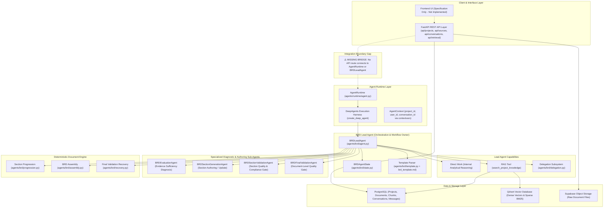
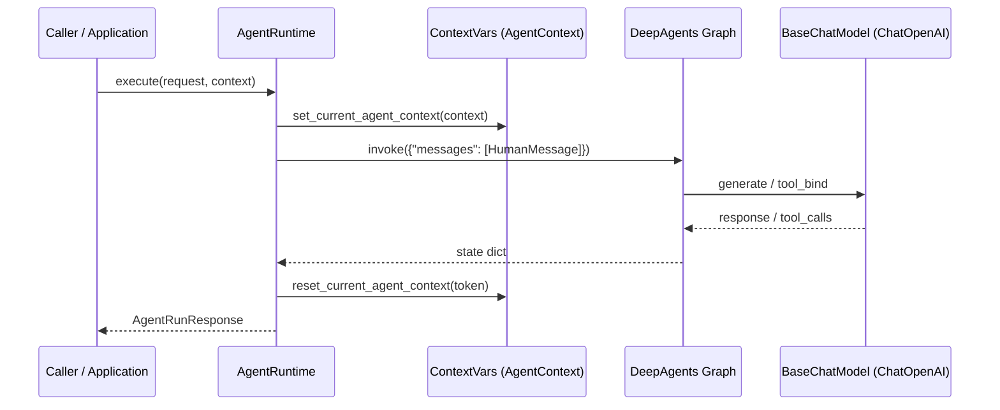
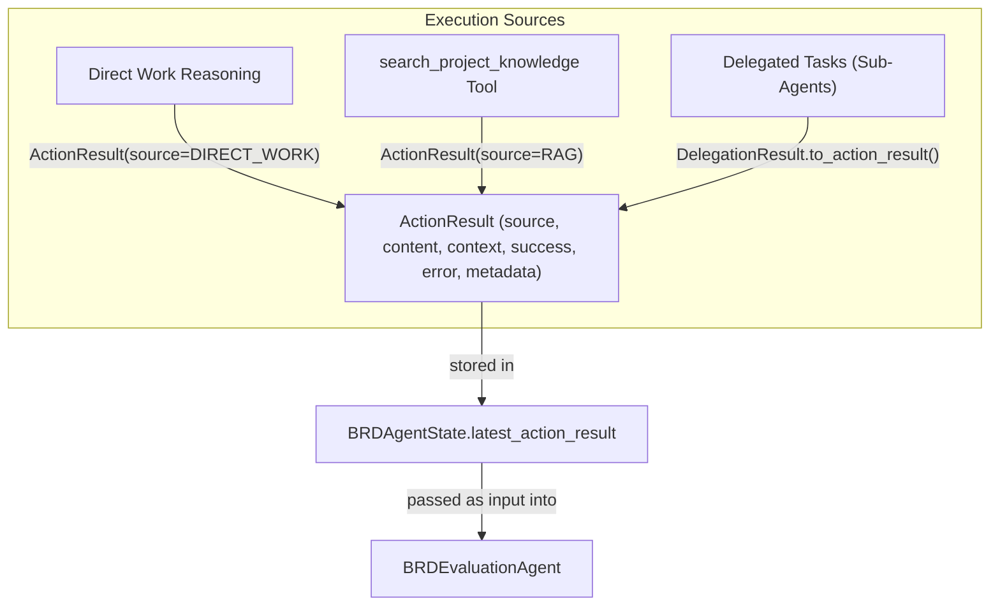
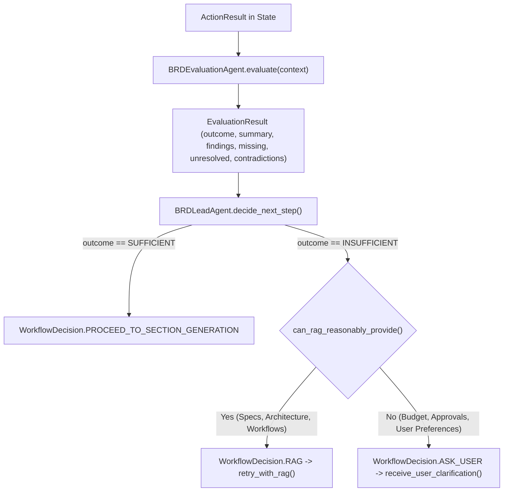
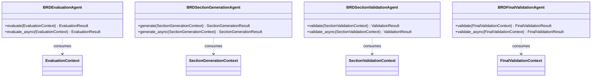
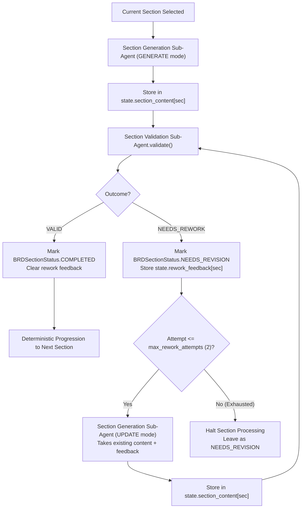
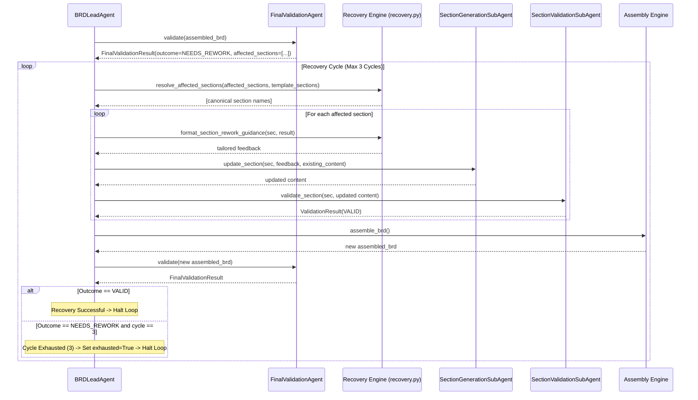
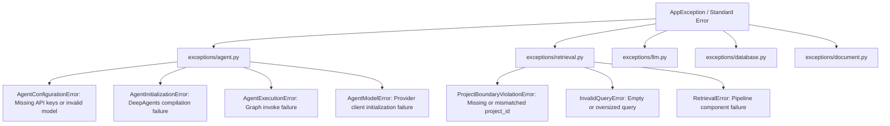

# BRD Agent - End-to-End Technical Architecture & Execution Guide

## 1. Executive Summary

This document provides a comprehensive, repository-grounded technical architecture audit and runtime execution guide for the Business Requirements Document (BRD) AI Agent within `agent-mvp`.

The primary objective of this audit is to answer:
> **"What exactly happens inside this application from the moment a user starts a BRD Agent request until the final BRD document is produced?"**

### Core Findings Summary
1. **Agent Domain Implementation Status**: The internal BRD generation pipeline is **fully implemented, extensively tested, and operational in code**. The system implements a hierarchical multi-agent architecture featuring a central orchestrator (`BRDLeadAgent`), four specialized task sub-agents (`Evaluation`, `Section Generation`, `Section Validation`, `Final Validation`), deterministic template-driven progression (`progression.py`), deterministic document assembly (`assembly.py`), and a bounded document-level recovery loop (`recovery.py`).
2. **Critical Connectivity Gap (The API & UI Boundary)**: The Agent subsystem is **completely disconnected from the FastAPI REST API layer and the Frontend**. While `backend/src/api/` exposes endpoints for Projects, Document Sources, RAG retrieval, and Conversation/Message CRUD, no HTTP route triggers `BRDLeadAgent` or `AgentRuntime`. The frontend directory contains only a README referencing an external specification (`FRONTEND_SPECIFICATION.md`). The Agent currently executes exclusively via programmatic Python calls and test suites.
3. **Template Truth**: The single source of truth for the BRD structure is [brd_template.md](file:///c:/DEXMIQ_PROJECTS/agent-mvp/backend/src/agents/brd/brd_template.md), which defines **16 authoritative sections** adhering to the Dexmiq Consulting Document Standard. Earlier unit tests in `test_brd_agent_context_foundation.py` that assumed a 5-section dummy template fail because the codebase transitioned to the 16-section template.
4. **Architectural Discipline & Isolation**:
   - The language model is **never** the authority for selecting tenant/project boundaries. Project boundary (`project_id`) is strictly enforced by the application environment via `contextvars` (`AgentContext`) and passed downstream to the RAG tool and retrieval pipeline.
   - Sub-agents are **stateless and toolless** execution workers. They cannot invoke RAG, access databases, or recursively delegate.
   - Document progression, assembly, and recovery loop limits are **pure deterministic Python logic**, completely immune to LLM hallucination or skipping.
5. **Output Persistence Gap**: Once assembled and validated, the final document resides in memory in `BRDAgentState.assembled_brd`. There is currently **no database model or persistence mechanism** saving the generated BRD into PostgreSQL or object storage.

---

## 2. System Overview

The system architecture partitions concerns across distinct layers:



---

## 3. Repository Structure

The repository is structured as a monorepo containing `backend/` and `frontend/`:

```text
c:\DEXMIQ_PROJECTS\agent-mvp\
├── .gitignore
├── FRONTEND_SPECIFICATION.md       # Comprehensive specification for frontend UI
├── README.md                       # High-level repo summary
├── frontend\                       # Frontend application workspace
│   └── README.md                   # References FRONTEND_SPECIFICATION.md (NO CODE IMPLEMENTED)
└── backend\                        # Python FastAPI + Agent backend
    ├── pyproject.toml              # Dependencies (deepagents, langchain-openai, fastapi, qdrant-client)
    ├── uv.lock                     # Lockfile
    ├── docs\                       # Architectural design documents & guidelines
    ├── alembic\                    # Database migrations
    ├── src\                        # Production source code
    │   ├── app\
    │   │   └── main.py             # FastAPI factory, lifespan, global exception handlers
    │   ├── api\                    # HTTP API Route Definitions
    │   │   ├── projects.py         # Project CRUD
    │   │   ├── sources.py          # Document source ingestion & processing
    │   │   ├── conversations.py    # Conversation & message database CRUD
    │   │   ├── retrieval.py        # Project-scoped RAG retrieval endpoint
    │   │   └── dependencies.py     # FastAPI dependency injections
    │   ├── agents\                 # Agent Domain Subsystem
    │   │   ├── runtime\            # DeepAgents harness and execution infrastructure
    │   │   │   ├── agent.py        # AgentRuntime, create_runtime_agent
    │   │   │   ├── config.py       # AgentConfig (loads from env/settings)
    │   │   │   ├── model.py        # create_agent_model (ChatOpenAI wrapper)
    │   │   │   └── state.py        # AgentContext, ActionResult, AgentRunRequest/Response
    │   │   └── brd\                # BRD Domain Subsystem
    │   │       ├── agent.py        # BRDLeadAgent orchestrator (2567 lines)
    │   │       ├── state.py        # BRDAgentState working operational state (637 lines)
    │   │       ├── template.py     # Template parser & section requirement extractor
    │   │       ├── brd_template.md # Single source of truth 16-section template
    │   │       ├── system_instruction.md # Behavioral system instructions
    │   │       ├── delegation.py   # Temporary subagent decomposition & execution
    │   │       ├── progression.py  # Deterministic section progression
    │   │       ├── assembly.py     # Deterministic document assembly
    │   │       ├── recovery.py     # Final validation recovery loop helpers
    │   │       ├── evaluation\     # Evidence Evaluation Sub-Agent
    │   │       ├── section_generation\ # Section Authoring Sub-Agent
    │   │       ├── section_validation\ # Section Validation Sub-Agent
    │   │       └── final_validation\   # Final Document Quality Gate Sub-Agent
    │   ├── rag\                    # Complete modular RAG retrieval pipeline
    │   ├── services\               # Application services (Project, Document, Conversation, RAG)
    │   ├── tools\                  # Agent tools (search_project_knowledge, echo_diagnostic)
    │   ├── models\                 # SQLAlchemy ORM models (Project, Document, Chunk, Conversation, Message)
    │   ├── db\                     # Async engine & session management
    │   └── storage\                # Supabase storage & Qdrant vector client abstractions
    └── tests\                      # 60 test suites covering all modules
```

---

## 4. Component Map

The table below catalogs every major component across the codebase, its status, role, and verified runtime behavior:

| Component Path | Classification | Status | Active Role in Runtime |
| :--- | :--- | :--- | :--- |
| `frontend/` | UI Layer | **Specification Only** | Contains only `README.md`. No UI code exists. |
| `backend/src/app/main.py` | Application Entry | **Actively Used** | Configures FastAPI app, mounts `api_router`, registers exception handlers, manages DB lifespan. |
| `backend/src/api/conversations.py` | API Layer | **Actively Used (CRUD only)** | Provides CRUD for conversations and messages. **Does not trigger the agent.** |
| `backend/src/api/retrieval.py` | API Layer | **Actively Used** | Direct HTTP endpoint for testing and executing RAG retrieval against a project. |
| `backend/src/api/projects.py` | API Layer | **Actively Used** | Project tenant management endpoints. |
| `backend/src/api/sources.py` | API Layer | **Actively Used** | Ingestion pipeline endpoints for document parsing and indexing. |
| `backend/src/agents/runtime/agent.py` | Agent Runtime | **Actively Used** | `AgentRuntime`: initializes DeepAgents graph (`create_runtime_agent`), manages execution context. |
| `backend/src/agents/runtime/config.py` | Runtime Config | **Actively Used** | Resolves model credentials and parameters (`AgentConfig.from_settings()`). |
| `backend/src/agents/runtime/model.py` | Model Factory | **Actively Used** | Instantiates LangChain `ChatOpenAI` configured for OpenRouter. |
| `backend/src/agents/runtime/state.py` | Context/State | **Actively Used** | Enforces `AgentContext` isolation via `contextvars`; defines `ActionResult` & `AgentRunResponse`. |
| `backend/src/agents/brd/agent.py` | Lead Agent | **Actively Used** | `BRDLeadAgent`: Orchestrates the complete BRD lifecycle from evidence to final document. |
| `backend/src/agents/brd/state.py` | Operational State | **Actively Used** | `BRDAgentState`: In-memory state tracking progress across all 16 template sections. |
| `backend/src/agents/brd/template.py` | Template Engine | **Actively Used** | Parses `brd_template.md`, extracts section names, templates, and requirements. |
| `backend/src/agents/brd/brd_template.md` | Authoritative Asset | **Actively Used** | 16-section Dexmiq document template (Single Source of Truth). |
| `backend/src/agents/brd/system_instruction.md` | Authoritative Asset | **Actively Used** | Behavioral instructions for `BRDLeadAgent`. |
| `backend/src/agents/brd/delegation.py` | Lead Capability | **Actively Used** | Decomposes composite objectives into temporary task-scoped sub-agents. |
| `backend/src/agents/brd/evaluation/` | Sub-Agent | **Actively Used** | Diagnoses evidence sufficiency (`SUFFICIENT` vs `INSUFFICIENT`). Toolless. |
| `backend/src/agents/brd/section_generation/` | Sub-Agent | **Actively Used** | Authors or updates individual section markdown (`GENERATE` vs `UPDATE`). Toolless. |
| `backend/src/agents/brd/section_validation/` | Sub-Agent | **Actively Used** | Validates section against template and evidence (`VALID` vs `NEEDS_REWORK`). Toolless. |
| `backend/src/agents/brd/progression.py` | Deterministic Logic | **Actively Used** | Template-driven section progression without LLM intervention. |
| `backend/src/agents/brd/assembly.py` | Deterministic Logic | **Actively Used** | Validates all sections completed, combines into final document. |
| `backend/src/agents/brd/final_validation/` | Sub-Agent | **Actively Used** | Validates complete document for cross-section consistency. Toolless. |
| `backend/src/agents/brd/recovery.py` | Recovery Engine | **Actively Used** | Resolves affected sections and executes recovery loop (capped at 3 cycles). |
| `backend/src/tools/rag.py` | Agent Tool | **Actively Used** | `search_project_knowledge`: bridges Agent to RAGService enforcing `project_id` context. |
| `backend/src/services/rag_service.py` | Application Service | **Actively Used** | Bridge to modular retrieval pipeline. |
| `backend/src/rag/retrieval/` | Pipeline Service | **Actively Used** | 12-stage retrieval pipeline (Dense + Sparse BM25 + RRF + Cross-Encoder Reranking + Postgres Hydration). |

---

## 5. User Request Entry Point

### Primary Entry Path (Current State)
Currently, **there is no HTTP API entry point that routes into the Agent runtime**.

When evaluating how an external user interacts with the system today:
1. A user can create a Project via `POST /projects`.
2. A user can upload documents via `POST /projects/{project_id}/sources/upload`.
3. A user can query the RAG pipeline via `POST /projects/{project_id}/retrieval`.
4. A user can create conversations and post messages via `POST /projects/{project_id}/conversations/{conversation_id}/messages`.
   - **Crucial Finding**: `ConversationService.create_message()` strictly inserts a record into the PostgreSQL `messages` table. It does **not** invoke `AgentRuntime` or `BRDLeadAgent`.

### Programmatic Entry Point (How the Agent actually executes today)
The Agent is executed programmatically in Python code and automated test workflows via:

```python
from agents.brd import create_brd_lead_agent
from agents.runtime.state import AgentContext

# 1. Establish tenant boundary
context = AgentContext(project_id="proj_123", conversation_id="conv_456")

# 2. Initialize Lead Agent
agent = create_brd_lead_agent()

# 3. Execute End-to-End BRD Generation
# Option A: Sequential automated pipeline
results = agent.process_all_sections(
    context=context,
    auto_assemble=True,
    auto_validate_final=True,
    auto_recover_final=True
)

# Option B: Conversational / Stepwise execution
run_response = agent.execute(
    request="Generate the Purpose & Scope section based on discovery notes.",
    context=context
)
```

---

## 6. Agent Runtime

The Agent Runtime resides in [agents/runtime/](file:///c:/DEXMIQ_PROJECTS/agent-mvp/backend/src/agents/runtime/).



### 1. Initialization & Configuration
- **Configuration** ([runtime/config.py](file:///c:/DEXMIQ_PROJECTS/agent-mvp/backend/src/agents/runtime/config.py)): `AgentConfig.from_settings()` loads settings from `Settings` / `.env`.
  - Credentials evaluated with fallback: `OPENROUTER_API_KEY` -> `OPENAI_API_KEY`.
  - Base URL defaults to `https://openrouter.ai/api/v1`.
  - Model defaults to `gpt-4o` (or `gemini-2.5-flash` in defaults).
  - Validation: `AgentConfig.validate()` mandates non-empty `model` and non-empty `api_key`.
- **Model Construction** ([runtime/model.py](file:///c:/DEXMIQ_PROJECTS/agent-mvp/backend/src/agents/runtime/model.py)): `create_agent_model()` constructs a LangChain `ChatOpenAI` instance with default headers (`HTTP-Referer`, `X-Title`).

### 2. Tenant Boundary Isolation (`AgentContext`)
In [runtime/state.py](file:///c:/DEXMIQ_PROJECTS/agent-mvp/backend/src/agents/runtime/state.py):
- `AgentContext` is a frozen dataclass holding `project_id`, `conversation_id`, `user_id`, and `metadata`.
- Isolation is managed via Python `contextvars`:
  ```python
  _current_agent_context: ContextVar[Optional[AgentContext]] = ContextVar("current_agent_context", default=None)
  ```
- Before execution, `AgentRuntime.execute()` sets the context token; in a `finally` block, it guarantees `reset_current_agent_context(token)`.
- Tools (like `search_project_knowledge`) read `get_current_agent_context()` to resolve `project_id`. **The LLM is never prompted for or allowed to specify tenant identifiers.**

### 3. Execution Interfaces
`AgentRuntime` provides:
- `execute(request: AgentRunRequest | str, context: Optional[AgentContext]) -> AgentRunResponse`: Synchronous execution.
- `execute_async(request: AgentRunRequest | str, context: Optional[AgentContext]) -> AgentRunResponse`: Asynchronous execution using `ainvoke`.
- Normalizes output text, messages, tool calls, and model metadata into `AgentRunResponse`.

---

## 7. DeepAgents Harness

The project integrates `deepagents>=0.7.18`:
- In `backend/src/agents/runtime/agent.py`:
  ```python
  from deepagents import create_deep_agent
  ```
- `create_runtime_agent(model, tools, system_prompt)` compiles a runnable state graph.
- **What DeepAgents actually does in this implementation**:
  - DeepAgents provides the underlying compiled LangGraph runnable for tool-binding and multi-turn message handling.
  - The runtime feeds `{"messages": [HumanMessage(content=...)]}` into `self._graph.invoke()` / `self._graph.ainvoke()`.
  - For the BRD domain, the custom state representation [BRDDeepAgentState](file:///c:/DEXMIQ_PROJECTS/agent-mvp/backend/src/agents/brd/state.py#L605) inherits from `DeepAgentState`, providing type compatibility if DeepAgents state passing is leveraged.

---

## 8. BRD Lead Agent

The `BRDLeadAgent` ([agents/brd/agent.py](file:///c:/DEXMIQ_PROJECTS/agent-mvp/backend/src/agents/brd/agent.py)) is the central domain orchestrator (2567 lines of code).

### The Three Foundational Pillars
1. **Behavioral System Instruction**: Loaded from [system_instruction.md](file:///c:/DEXMIQ_PROJECTS/agent-mvp/backend/src/agents/brd/system_instruction.md) via `load_system_instruction()`. Defines identity, grounding rules, gap awareness, and operational modes.
2. **Authoritative BRD Template**: Loaded from [brd_template.md](file:///c:/DEXMIQ_PROJECTS/agent-mvp/backend/src/agents/brd/brd_template.md) via `load_brd_template()`. Single source of truth for the 16 required sections.
3. **Operational Working State**: Maintained via `BRDAgentState` ([agents/brd/state.py](file:///c:/DEXMIQ_PROJECTS/agent-mvp/backend/src/agents/brd/state.py)). Tracks section completion, evidence, validation results, and assembly.

### Clear Boundary of Responsibilities

| Responsibility Tier | Components | Exact Remit |
| :--- | :--- | :--- |
| **Workflow & Decision Authority** | `BRDLeadAgent` | Owns objective, determines work mode (Direct Work vs RAG vs Delegation), decides next step after evaluation, controls retry loops, triggers assembly, initiates recovery. |
| **Diagnostic Specialized Sub-Agents** | `EvaluationSubAgent`<br>`SectionValidationAgent`<br>`FinalValidationAgent` | **Toolless and stateless.** Evaluate inputs against criteria. Produce structured findings and categorical outcomes. **Never modify documents or make workflow decisions.** |
| **Authoring Specialized Sub-Agent** | `SectionGenerationSubAgent` | **Toolless.** Generates or updates markdown content for a single section given evidence and requirements. Does not orchestrate. |
| **Deterministic Logic** | `progression.py`<br>`assembly.py`<br>`recovery.py` | Non-LLM algorithms enforcing template sequence, section concatenation, and cycle bounding (max 3). |

---

## 9. Agent State

`BRDAgentState` ([agents/brd/state.py](file:///c:/DEXMIQ_PROJECTS/agent-mvp/backend/src/agents/brd/state.py)) is an in-memory Python dataclass encapsulating the agent's working context:

### State Fields Table

| State Field | Type | Purpose | Created By | Modified By | Read By | Persisted in DB? |
| :--- | :--- | :--- | :--- | :--- | :--- | :--- |
| `objective` | `str` | Broad BRD goal | `initialize_from_template` | `BRDLeadAgent` | All sub-agents | **No** |
| `current_task` | `Optional[str]` | Immediate sub-goal | Initialization | `set_current_task()` | Sub-agents | **No** |
| `template_sections` | `list[str]` | Authoritative 16 sections | `template.py` | Read-only | `progression`, `assembly` | **No** |
| `current_section` | `Optional[str]` | Active section being authored | Progression | `set_current_section()` | Generator, Validator | **No** |
| `section_progress` | `dict[str, BRDSectionStatus]`| Status (`Not Started`, `In Progress`, `Completed`, `Needs Revision`)| Initialization | `update_section_status` | `progression`, `assembly` | **No** |
| `evidence` | `list[Any]` | Accumulated verified facts | RAG / Direct Work | `add_evidence()` | Evaluator, Generator | **No** |
| `unresolved_information` | `list[str]` | Gaps or open questions | Evaluator findings | `add_unresolved()` | Lead Agent, Evaluator | **No** |
| `delegated_tasks` | `list[DelegatedTask]` | Decomposed tasks | `decompose_objective` | `set_delegated_tasks()` | Delegation engine | **No** |
| `task_results` | `list[TaskResult]` | Attributable task outputs | Temporary sub-agents | `add_task_result()` | Lead Agent | **No** |
| `delegation_result` | `Optional[DelegationResult]` | Aggregated delegation | `collect_task_results` | `set_delegation_result()` | Lead Agent | **No** |
| `latest_action_result`| `Optional[ActionResult]` | Converged work result | Direct Work/RAG/Delegation | `set_action_result()` | `EvaluationSubAgent` | **No** |
| `latest_evaluation_result` | `Optional[EvaluationResult]` | Latest evidence diagnosis | `EvaluationSubAgent` | `set_evaluation_result()` | Lead Agent (`decide_next_step`) | **No** |
| `section_content` | `dict[str, str]` | Validated section markdown | `SectionGenerationSubAgent`| `set_section_content()` | `assembly.py`, Validator | **No** |
| `rework_feedback` | `dict[str, str]` | Rework guidance for section | `SectionValidationAgent` | `set_rework_feedback()` | `SectionGenerationSubAgent` | **No** |
| `latest_validation_result` | `Optional[ValidationResult]` | Section validation findings | `SectionValidationAgent` | `set_validation_result()`| Lead Agent | **No** |
| `assembled_brd` | `Optional[str]` | Assembled full document | `assemble_brd_document` | `set_assembled_brd()` | `FinalValidationAgent` | **No** |
| `final_validation_history` | `list[FinalValidationResult]` | Final validation attempts | `FinalValidationAgent` | `set_final_validation_result()` | Recovery loop | **No** |
| `final_validation_recovery_cycles` | `int` | Count of recovery cycles (0..3)| Recovery loop | `increment_recovery_cycle()` | Recovery loop | **No** |
| `final_validation_recovery_exhausted` | `bool` | True if max 3 cycles failed | Recovery loop | `set_recovery_exhausted()` | Lead Agent | **No** |

---

## 10. Template System

The BRD Template subsystem is implemented in [agents/brd/template.py](file:///c:/DEXMIQ_PROJECTS/agent-mvp/backend/src/agents/brd/template.py).

```text
[brd_template.md]
        ↓ load_brd_template()
Raw Markdown String
        ↓ extract_brd_sections()
16 Top-Level Headings List
        ↓ extract_section_template(section_name) / extract_section_requirements(section_name)
Section Structure & Requirements (Passed to Section Generation & Validation)
        ↓ assemble_brd_document()
Final Document Assembly
```

### The 16 Authoritative Dexmiq Sections
Extracted dynamically from `brd_template.md`:
1. `Dexmiq Standard Document Header`
2. `Version History`
3. `1. Purpose & Scope of This Document`
4. `2. Business Context (Summary from Discovery)`
5. `3. In-Scope Business Modules & Feature Groups`
6. `4. Out-of-Scope Items`
7. `5. Stakeholders & Personas` (Subsections: `5.1 Personas`, `5.2 Persona–Module Mapping`)
8. `6. High-Level Business Requirements by Module` (Subsection: `6.x Module: [Name]`)
9. `7. Conceptual Business Workflows`
10. `8. Integrations (High-Level Business View)`
11. `9. Assumptions & Constraints`
12. `10. High-Level Acceptance Criteria`
13. `11. Regulatory / Policy Requirements (High-Level)`
14. `12. Traceability Overview`
15. `13. Risks, Dependencies & Open Questions`
16. `14. HL-BRD Quality Gate & Completeness Snapshot` (Subsection: `Quality Gate Checklist`)

### Fallback & Robustness
- If `brd_template.md` is missing, `load_brd_template()` raises `FileNotFoundError`.
- If the file is empty, it raises `ValueError`.
- `extract_section_template(section_name)` extracts child subsections (e.g. `## 5.1 Personas`) and markdown tables up to the next sibling section. If not found, it generates a fallback structure.

---

## 11. RAG Integration

The Agent interacts with RAG through a dedicated tool boundary:

```mermaid
flowchart LR
    LA["BRD Lead Agent"] -->|"calls search_project_knowledge(query)"| TOOL["search_project_knowledge (tools/rag.py)"]
    CTX["AgentContext (contextvars)"] -->|"provides project_id"| TOOL
    TOOL -->|"service.retrieve(project_id, query)"| RS["RAGService (rag/retrieval/service.py)"]
    
    subgraph Retrieval_Pipeline ["12-Stage Retrieval Pipeline"]
        RS --> PRE["1. Preprocessing"]
        PRE --> TRANS["2. Transformation"]
        TRANS --> EMB["3. Query Embedding (Voyage AI)"]
        EMB --> DENSE["4. Dense Vector Search (Qdrant)"]
        EMB --> SPARSE["5. Sparse Keyword Search (Qdrant BM25)"]
        DENSE & SPARSE --> FUS["6. Hybrid Fusion (RRF)"]
        FUS --> FILT["7. Metadata Filtering (project_id)"]
        FILT --> RERANK["8. Cross-Encoder Reranking"]
        RERANK --> HYD["9. Chunk Hydration (PostgreSQL)"]
        HYD --> ASMB["10. Context Assembly"]
        ASMB --> REL["11. Relevance Checking"]
        REL --> FMT["12. Context Formatting"]
    end

    FMT -->|"RetrievalResult"| TOOL
    TOOL -->|"[RETRIEVAL_SUCCESS] / [NO_EVIDENCE]"| LA
```



### Mandatory Project Isolation
1. **Tool Schema**: `SearchProjectKnowledgeInput` exposes **only `query: str`**. The LLM cannot provide or alter `project_id`.
2. **Context Resolution**: The tool extracts `project_id = get_current_agent_context().project_id`. If absent, it halts immediately with `[RETRIEVAL_ERROR] Project boundary violation`.
3. **Pipeline Enforcement**: `RAGService.retrieve()` validates `isinstance(project_id, str) and project_id.strip()`. Qdrant filters strictly match `{"project_id": project_id}`. PostgreSQL hydration queries chunks with `WHERE project_id = :project_id`.

---

## 12. Action / Evidence Flow

Every piece of work produced by the Agent converges onto a normalized data model: `ActionResult` ([runtime/state.py](file:///c:/DEXMIQ_PROJECTS/agent-mvp/backend/src/agents/runtime/state.py#L64)).



This abstraction ensures that downstream evaluation and generation sub-agents treat results uniformly regardless of whether they were retrieved, reasoned, or delegated.

---

## 13. Evidence Evaluation

Implemented in [agents/brd/evaluation/agent.py](file:///c:/DEXMIQ_PROJECTS/agent-mvp/backend/src/agents/brd/evaluation/agent.py).

### Role & Remit
The `EvaluationSubAgent` is a **diagnostic specialist** that assesses whether an `ActionResult` contains sufficient evidence to satisfy the current section requirements.

### Workflow & Decision Boundary
> **"The Evaluator diagnoses evidence sufficiency; the Lead Agent owns the workflow decision."**



- **Output Structure**:
  - `outcome`: Categorical `SUFFICIENT` or `INSUFFICIENT` (no arbitrary numeric scores).
  - `findings`: Key observations categorized by `InformationStatus` (`Present`, `Missing`, `Unclear / Unresolved`, `Contradictory`, `Not Applicable`).
  - `missing_information`, `unresolved_information`, `contradictions`.
- **Toolless**: Has no tools, cannot query RAG or databases.

---

## 14. Delegation and Sub-Agents

Implemented in [agents/brd/delegation.py](file:///c:/DEXMIQ_PROJECTS/agent-mvp/backend/src/agents/brd/delegation.py).

### How Delegation Works
1. **Trigger**: When an objective is complex or composite, `BRDLeadAgent.delegate()` decomposes the objective into bounded `DelegatedTask` objects.
2. **Decomposition**: Dynamic count (e.g. 2 to 5 tasks), each with `task_id`, `objective`, `relevant_context`, `scope`, `constraints`, and `expected_output`.
3. **Execution**:
   - `execute_subagent_task()` spawns a temporary DeepAgents graph (`create_runtime_agent`).
   - The subagent receives **only the scoped prompt** and strictly inherits the parent's `project_id`.
   - **Recursion Restriction**: Subagents receive no delegation tools. Delegation depth is strictly capped at 1.
4. **Attribution & Aggregation**: Each subagent returns a `TaskResult` with runtime metrics and content. `collect_task_results()` combines them into a `DelegationResult`, which maps to `ActionResult(source=ActionSource.DELEGATION)`.

---

## 15. Specialized Sub-Agents

The system features four dedicated specialized sub-agents. All four are **stateless and toolless**:



### 15.1 Evaluation Sub-Agent
- **Purpose**: Diagnoses evidence sufficiency for a section objective.
- **Input**: `EvaluationContext` (objective, section name, section requirements, action result, working context).
- **Output**: `EvaluationResult` (`SUFFICIENT` vs `INSUFFICIENT`, missing information, contradictions).

### 15.2 Section Generation Sub-Agent
- **Purpose**: Drafts or updates a specific section in Markdown.
- **Input**: `SectionGenerationContext` (section name, template structure, section requirements, available evidence, existing content, rework feedback).
- **Operation Modes**:
  - `GENERATE`: First-time creation.
  - `UPDATE`: Rework incorporating existing content and validation feedback.
- **Output**: `SectionGenerationResult` (section name, content, operation, summary).

### 15.3 Section Validation Sub-Agent
- **Purpose**: Evaluates an authored section against quality criteria and template rules.
- **Input**: `SectionValidationContext` (section name, content, requirements, template structure, evidence, prior feedback).
- **Evaluation Categories**: `Template Compliance`, `Requirement Coverage`, `Completeness`, `Specificity`, `Grounding`, `Consistency`, `Relevance`.
- **Output**: `ValidationResult` (`VALID` vs `NEEDS_REWORK`, findings, rework feedback).
- **Strict Boundary**: Produces findings only; **never rewrites or auto-repairs**.

### 15.4 Final Validation Sub-Agent
- **Purpose**: Document-level quality gate evaluating the complete assembled BRD.
- **Input**: `FinalValidationContext` (assembled document, template info, project evidence).
- **Evaluation Categories**: `Cross-Section Consistency`, `Requirement Consistency`, `Terminology Consistency`, `Grounding`, `Completeness`, `Duplication`, `Overall Coherence`.
- **Output**: `FinalValidationResult` (`VALID` vs `NEEDS_REWORK`, findings with `affected_sections`, rework feedback).

---

## 16. Section Lifecycle

Every individual BRD section progresses through a defined authoring, validation, and rework lifecycle:



The maximum section rework retry limit is **2** (`max_rework_attempts = 2`).

---

## 17. Section Progression

Section progression ([agents/brd/progression.py](file:///c:/DEXMIQ_PROJECTS/agent-mvp/backend/src/agents/brd/progression.py)) is **100% deterministic Python logic**:

1. **Ordering Authority**: Strictly uses `template_sections` extracted from `brd_template.md`.
2. **Transition Rule**: `progress_to_next_section()` checks `state.get_section_status(current_section)`. If status is not `COMPLETED`, it raises `ValueError("Cannot advance progression: section is not completed")`.
3. **Next Section Activation**:
   - Finds index of current section in template list.
   - Activates `template_sections[index + 1]` as `current_section`.
   - Transitions its status to `IN_PROGRESS`.
4. **Completion Detection**:
   - When the 16th section completes, `next_section` is `None`.
   - Sets `current_section = None` and `section_processing_complete = True`.
- **Why this is deterministic**: Handing progression authority to the LLM would permit hallucinations, skipping sections, or premature completion. Python code guarantees that all 16 sections must be completed in order.

---

## 18. BRD Assembly

BRD Assembly ([agents/brd/assembly.py](file:///c:/DEXMIQ_PROJECTS/agent-mvp/backend/src/agents/brd/assembly.py)) compiles individual section contents into a single markdown document:

### Pre-conditions
- `is_section_processing_complete(state)` must be `True`. If any of the 16 sections is not `COMPLETED`, assembly raises `ValueError("Cannot assemble BRD: section processing is incomplete")`.
- Every completed section must have non-empty content in `state.section_content`.

### Assembly Algorithm
1. Iterates over all 16 sections in exact template order.
2. For each section, retrieves content via `state.get_section_content(sec)`.
3. Formats headings via `format_section_for_assembly()`:
   - If the section content already begins with the section heading (e.g. `# 1. Purpose & Scope...`), it preserves it as-is to prevent duplicate headings.
   - If missing, it deterministically prepends the template heading prefix (`#` or `##`).
4. Joins sections with clean Markdown horizontal dividers.
5. Saves result in `state.assembled_brd` and `state.latest_assembly_result`.
6. Operation is completely idempotent.

---

## 19. Final Validation

Implemented in [agents/brd/final_validation/agent.py](file:///c:/DEXMIQ_PROJECTS/agent-mvp/backend/src/agents/brd/final_validation/agent.py).

- **Execution**: Triggered via `BRDLeadAgent.validate_final_brd()`.
- **Input**: The complete `assembled_brd` from state.
- **Diagnostic Focus**: Cross-section coherence (e.g., does module in Section 3 match requirement in Section 6? Are personas in Section 5 mapped in Section 5.2? Are out-of-scope exclusions in Section 4 violated in Section 6?).
- **Findings**: Every finding records:
  - `category`: e.g. `CROSS_SECTION_CONSISTENCY`, `TERMINOLOGY_CONSISTENCY`
  - `severity`: `ERROR` or `WARNING`
  - `issue`: concise description
  - `affected_sections`: list of template section names that require edits
  - `required_change`: concrete instruction
- If any finding has severity `ERROR`, the outcome is `NEEDS_REWORK`.

---

## 20. Final Validation Recovery

Implemented in [agents/brd/recovery.py](file:///c:/DEXMIQ_PROJECTS/agent-mvp/backend/src/agents/brd/recovery.py) and `BRDLeadAgent.recover_final_validation()`:



### Verified Constraints
- **Maximum Recovery Cycles**: `MAX_FINAL_VALIDATION_RECOVERY_CYCLES = 3` (strictly bounded).
- **Candidate Section Resolution**: `resolve_affected_sections()` handles numeric stripping, "Section N" matching, and case-insensitivity to reliably target template sections.
- **Safe Failure**: If a section fails section-level validation during recovery or an error occurs, the loop halts safely and does **not** mark the BRD as valid.
- If cycle count reaches 3 without reaching `VALID`, `state.final_validation_recovery_exhausted` is set to `True`.

---

## 21. Final Output / Delivery

### Current Implementation State
- When `FinalValidationResult` is `VALID`, the final document resides in memory in `BRDAgentState.assembled_brd`.
- **Delivery Mechanisms**:
  - Returned in Python memory to the calling function / test as `FinalValidationRecoveryResult` or `BRDAssemblyResult`.
  - Accessible via `agent.assembled_brd` or `agent.state.assembled_brd`.
- **Gaps in Delivery**:
  - **No Database Persistence**: There is no table in PostgreSQL storing completed BRD documents or agent runs.
  - **No Object Storage Export**: The document is not converted to DOCX or uploaded to Supabase Storage.
  - **No REST Response**: Because no API endpoint invokes the agent, the document is not transmitted across HTTP to any client.

---

## 22. Error Handling

The application defines a strict hierarchy of domain exceptions across subsystems:



### Error Handling Behavior Matrix

| Failure Point | Detected By | Handled By | State Outcome | Retries? | User / Caller Impact |
| :--- | :--- | :--- | :--- | :--- | :--- |
| **Missing API Key** | `AgentConfig.validate()` | `AgentRuntime.__init__` | Initialization fails | No | Raises `AgentConfigurationError` (blocks startup) |
| **Project Boundary Missing** | `tools/rag.py` | `_execute_knowledge_search` | Context unchanged | No | Returns `[RETRIEVAL_ERROR]` string to agent |
| **RAG Service Failure** | `RAGService.retrieve()` | `_execute_knowledge_search` | Context unchanged | No | Returns `[RETRIEVAL_ERROR]` string to agent |
| **Zero Retrieval Chunks** | `RAGService.retrieve()` | `_execute_knowledge_search` | `evidence` empty | Handled by Lead Agent | Returns `[NO_EVIDENCE]` string; agent decides next step |
| **Delegated Task Failure** | `execute_subagent_task` | `delegation.py` | Recorded in `TaskResult` | No | `TaskResult(success=False, error=...)`; execution continues |
| **Section Validation Fail** | `SectionValidationAgent` | `generate_and_validate_section`| `NEEDS_REVISION` | **Yes (up to 2)** | Section update invoked with feedback; if exhausted, stops |
| **Incomplete Assembly** | `assemble_brd_document` | `assembly.py` | Assembly aborted | No | Raises `ValueError` listing uncompleted sections |
| **Final Validation Fail** | `FinalValidationAgent` | `recover_final_validation` | `final_validation_history` | **Yes (up to 3)** | Reworks affected sections; if exhausted, marks `exhausted=True` |

---

## 23. Logging & Observability

Logging is implemented using structured standard library logging configured via `observability/logging.py`:

- **Tenant Traceability**: Key log events include `project_id` in their format strings:
  - `Agent execution started (model: %s, project_id: %s, prompt_len: %d)`
  - `RAG tool invocation: searching project knowledge (project_id: %s, query_len: %d)`
  - `Sub-agent task execution started (task_id: %s, project_id: %s)`
  - `BRD section completed: %s (project_id: %s)`
  - `BRD assembly started (project_id: %s, total_sections: %d)`
  - `BRD final validation recovery cycle %d completed (project_id: %s, outcome: %s)`
- **Debugging a Failed Run**: A developer can trace a failed execution by filtering logs for `project_id` and tracking:
  1. The section progression transitions.
  2. Sub-agent evaluation findings and rework feedback strings.
  3. Cycle counters `final_validation_recovery_cycles`.

---

## 24. Testing & Verification

The repository contains **60 test files** in `backend/tests/`.

### Agent & BRD Test Suite Execution Results

Tests were executed using pytest within the backend virtual environment:

| Test File | Capability Tested | Pass / Fail Count | Notes |
| :--- | :--- | :--- | :--- |
| `test_agent_config.py` | Config loading, masking, validation | **6 Passed**, 0 Failed | Fully verified |
| `test_agent_model.py` | Model factory, provider abstraction | **4 Passed**, 0 Failed | Fully verified |
| `test_agent_runner.py` | Runner invocation | **5 Passed**, 0 Failed | Fully verified |
| `test_agent_runtime.py` | DeepAgents graph, contextvars | **8 Passed**, 0 Failed | Fully verified |
| `test_brd_agent_context_foundation.py` | Template loading, state, 3 pillars | **20 Passed**, **4 Failed** | **4 pre-existing failures** due to legacy hardcoded 5-section assertions (template has 16 sections). |
| `test_brd_agent_direct_work.py` | Direct work reasoning & action results | **12 Passed**, 0 Failed | Fully verified |
| `test_brd_agent_rag_integration.py` | RAG tool, project isolation | **16 Passed**, 0 Failed | Fully verified |
| `test_brd_agent_delegation.py` | Task decomposition, temporary subagents | **17 Passed**, 0 Failed | Fully verified |
| `test_brd_agent_evaluation.py` | Evaluation sub-agent, sufficiency diagnosis | **23 Passed**, 0 Failed | Fully verified |
| `test_brd_agent_section_generation.py` | Authoring, update/rework modes | **19 Passed**, 0 Failed | Fully verified |
| `test_brd_agent_section_validation.py` | Section validation gate, rework feedback | **23 Passed**, 0 Failed | Fully verified |
| `test_brd_agent_section_progression.py` | Deterministic section progression | **20 Passed**, 0 Failed | Fully verified |
| `test_brd_agent_assembly.py` | Deterministic document assembly | **15 Passed**, 0 Failed | Fully verified |
| `test_brd_agent_final_validation.py` | Final validation quality gate | **19 Passed**, 0 Failed | Fully verified |
| `test_brd_agent_final_validation_recovery.py` | Final validation recovery loop | **21 Passed**, 0 Failed | Passes completely when `OPENROUTER_API_KEY` is present in env. |
| `test_brd_lead_agent.py` | End-to-end Lead Agent integration | **18 Passed**, 0 Failed | Fully verified |
| `test_api_conversations.py` | Conversation/Message CRUD | **4 Passed**, 0 Failed | Confirms API is purely CRUD, no agent trigger. |

**Total Tested in Agent Domain**: **227 Passed**, **4 Failed** (out of 231 tests).

---

## 25. End-to-End Connectivity Audit

| From Component | To Component | Connection Mechanism | Status | Evidence / Concrete Implementation |
| :--- | :--- | :--- | :--- | :--- |
| **Frontend UI** | **API Layer** | HTTP REST | **NOT CONNECTED** | `frontend/` contains only `README.md`. No client code exists. |
| **API Layer** | **Agent Runtime** | Service / Controller Call | **NOT CONNECTED** | `api/conversations.py` only saves to DB. No route imports `AgentRuntime` or `BRDLeadAgent`. |
| **Agent Runtime** | **DeepAgents** | Graph compilation | **CONNECTED** | `agents/runtime/agent.py`: `create_deep_agent(model, tools, system_prompt)` |
| **Agent Runtime** | **BRD Lead Agent** | Factory method | **CONNECTED** | `AgentRuntime.create_brd_lead_agent()` -> `agents/brd/agent.py:BRDLeadAgent` |
| **BRD Lead Agent** | **Agent State** | Direct aggregation | **CONNECTED** | `BRDLeadAgent._state` initialized with `BRDAgentState` in `agent.py:270` |
| **BRD Lead Agent** | **RAG Tool** | Tool registration | **CONNECTED** | `agent.py`: `create_search_project_knowledge_tool()` equipped in `tools` |
| **RAG Tool** | **RAG Service** | Async method call | **CONNECTED** | `tools/rag.py`: `_execute_knowledge_search()` calls `service.retrieve()` |
| **RAG Service** | **Vector Store / DB** | Qdrant / Postgres clients | **CONNECTED** | `rag/retrieval/service.py`: Qdrant client & Postgres `ChunkHydrationService` |
| **BRD Lead Agent** | **Evaluation Agent** | Sub-agent invocation | **CONNECTED** | `agent.py:evaluate()` calls `BRDEvaluationAgent.evaluate()` |
| **BRD Lead Agent** | **Delegation Subsystem**| Task decomposition | **CONNECTED** | `agent.py:delegate()` calls `delegation.py:execute_subagent_task()` |
| **BRD Lead Agent** | **Section Generator**| Sub-agent invocation | **CONNECTED** | `agent.py:generate_section()` calls `BRDSectionGenerationAgent.generate()` |
| **BRD Lead Agent** | **Section Validator**| Sub-agent invocation | **CONNECTED** | `agent.py:validate_section()` calls `BRDSectionValidationAgent.validate()` |
| **BRD Lead Agent** | **Section Progression**| Deterministic function | **CONNECTED** | `agent.py:progress_section()` calls `progression.py:progress_to_next_section()` |
| **BRD Lead Agent** | **Assembly Engine** | Deterministic function | **CONNECTED** | `agent.py:assemble_brd()` calls `assembly.py:assemble_brd_document()` |
| **BRD Lead Agent** | **Final Validator** | Sub-agent invocation | **CONNECTED** | `agent.py:validate_final_brd()` calls `BRDFinalValidationAgent.validate()` |
| **BRD Lead Agent** | **Recovery Engine** | Deterministic loop | **CONNECTED** | `agent.py:recover_final_validation()` orchestrates rework loop using `recovery.py` |
| **Final Document** | **Database Storage** | SQLAlchemy Insert | **NOT CONNECTED** | No database model (`BRDModel`) or insert query exists in `services/` or `models/`. |
| **Final Document** | **File / Object Store**| Supabase upload | **NOT CONNECTED** | No upload call exists in `assembly.py` or `agent.py`. Document remains in memory. |

---

## 26. Architecture vs Implementation

| Architectural Area | Intended Architecture | Actual Codebase Implementation | Discrepancy Impact | Recommended Timing |
| :--- | :--- | :--- | :--- | :--- |
| **API Entry Point** | User request arrives via API endpoint, triggering the Agent runtime. | API layer contains only CRUD endpoints (`conversations.py`, `sources.py`, `projects.py`). The Agent is never invoked from HTTP. | **BLOCKING for MVP**: No external user or frontend can invoke the agent. | Fix immediately after audit. |
| **Frontend UI** | Modern web interface for chat, section preview, and BRD document export. | Directory contains only `README.md` pointing to specification. | **BLOCKING for end-users**; not blocking for headless backend testing. | Implement in Phase 2. |
| **Document Persistence**| Final BRD document saved to PostgreSQL database and/or Supabase storage. | Assembled BRD stored only in Python in-memory state (`state.assembled_brd`). Disappears upon process termination. | **IMPORTANT**: Generated documents cannot be reloaded or viewed asynchronously. | Implement alongside API endpoint. |
| **Template Alignment in Tests** | Tests reflect the authoritative document template. | `test_brd_agent_context_foundation.py` still asserts 5 legacy sections, failing against the real 16-section Dexmiq template. | **MINOR**: Misleading test failures; implementation itself is correct. | Update test assertions to 16 sections. |
| **Test Fixture Config** | Test helpers supply mock configuration. | `create_test_lead_agent` in `test_brd_agent_final_validation_recovery.py` omits `config=AgentConfig(api_key="mock")`, causing failure if env var absent. | **MINOR**: Tests fail in environments lacking API keys unless monkeypatched. | Add mock config to test fixture. |
| **Progression Determinism** | Section progression controlled by template order, not LLM. | Fully implemented in `progression.py` and strictly verified. | **MATCHES INTENT**: Excellent robustness. | Maintain existing code. |
| **Recovery Loop Bounding** | Final validation recovery bounded at 3 cycles. | Fully implemented in `recovery.py` (`MAX_FINAL_VALIDATION_RECOVERY_CYCLES = 3`). | **MATCHES INTENT**: Excellent robustness. | Maintain existing code. |

---

## 27. Complete Runtime Walkthrough

The following step-by-step narrative follows the exact code execution path through the repository for a complete BRD generation run:

### Step 1 — Session & Tenant Initialization
- **Trigger**: Caller initializes execution context.
- **Component**: `AgentContext` ([runtime/state.py](file:///c:/DEXMIQ_PROJECTS/agent-mvp/backend/src/agents/runtime/state.py)).
- **Processing**: Dataclass created with `project_id="proj_alpha"`, `conversation_id="conv_beta"`. Token bound via `set_current_agent_context()`.
- **Output**: Immutable `AgentContext` accessible to all downstream tools via contextvars.

### Step 2 — BRD Lead Agent Instantiation
- **Trigger**: Factory call `create_brd_lead_agent(context=context)`.
- **Component**: `BRDLeadAgent` ([agents/brd/agent.py](file:///c:/DEXMIQ_PROJECTS/agent-mvp/backend/src/agents/brd/agent.py)).
- **Processing**:
  1. Loads `system_instruction.md` via `load_system_instruction()`.
  2. Loads `brd_template.md` via `load_brd_template()`.
  3. Extracts 16 sections via `extract_brd_sections()`.
  4. Initializes `BRDAgentState` with all 16 sections set to `BRDSectionStatus.NOT_STARTED`.
  5. Initializes sub-agents (`BRDEvaluationAgent`, `BRDSectionGenerationAgent`, `BRDSectionValidationAgent`, `BRDFinalValidationAgent`).
  6. Equips `search_project_knowledge` tool with `project_id` context binding.

### Step 3 — Section Progression Initialization
- **Trigger**: `agent.initialize_section_progression()`.
- **Component**: `agents/brd/progression.py`.
- **Processing**: Identifies first uncompleted section: `"Dexmiq Standard Document Header"`. Sets `state.current_section = "Dexmiq Standard Document Header"`, marks status `IN_PROGRESS`.

### Step 4 — Knowledge Retrieval & Evidence Collection
- **Trigger**: Agent determines project facts are needed for current section.
- **Component**: Tool `search_project_knowledge` ([tools/rag.py](file:///c:/DEXMIQ_PROJECTS/agent-mvp/backend/src/tools/rag.py)).
- **Processing**:
  1. Resolves `project_id` from `AgentContext`.
  2. Calls `RAGService.retrieve(project_id, query)`.
  3. RAG pipeline embeds query, runs dense vector search and BM25 sparse search in Qdrant, applies RRF fusion, filters by `project_id`, reranks via cross-encoder, hydrates chunk metadata from PostgreSQL, and formats context text.
- **Output**: Returns `[RETRIEVAL_SUCCESS] Found N relevant knowledge items...`.
- **State Change**: Packaged as `ActionResult(source=ActionSource.RAG)` and stored in `state.latest_action_result`.

### Step 5 — Evidence Evaluation Diagnosis
- **Trigger**: `agent.evaluate()`.
- **Component**: `BRDEvaluationAgent` ([agents/brd/evaluation/agent.py](file:///c:/DEXMIQ_PROJECTS/agent-mvp/backend/src/agents/brd/evaluation/agent.py)).
- **Processing**: Analyzes `ActionResult` against section requirements extracted via `extract_section_requirements()`.
- **Output**: Returns `EvaluationResult(outcome=SUFFICIENT)`.
- **State Change**: Result stored in `state.latest_evaluation_result` and appended to `evaluation_history`.

### Step 6 — Section Generation
- **Trigger**: Lead Agent calls `generate_section()`.
- **Component**: `BRDSectionGenerationAgent` ([agents/brd/section_generation/agent.py](file:///c:/DEXMIQ_PROJECTS/agent-mvp/backend/src/agents/brd/section_generation/agent.py)).
- **Processing**: Receives template structure from `extract_section_template()` and evidence. Generates structured Markdown complying with the template table/headers.
- **Output**: `SectionGenerationResult(content="...")`.
- **State Change**: Markdown saved in `state.section_content["Dexmiq Standard Document Header"]`.

### Step 7 — Section Validation Gate
- **Trigger**: Lead Agent calls `validate_section()`.
- **Component**: `BRDSectionValidationAgent` ([agents/brd/section_validation/agent.py](file:///c:/DEXMIQ_PROJECTS/agent-mvp/backend/src/agents/brd/section_validation/agent.py)).
- **Processing**: Checks template compliance, grounding, and requirement coverage.
- **Decision**:
  - If `VALID`: `state.update_section_status(sec, COMPLETED)`, clears rework feedback.
  - If `NEEDS_REWORK`: updates status to `NEEDS_REVISION`, records `rework_feedback`, triggers `update_section()` (up to 2 retries).

### Step 8 — Section Progression Loop
- **Trigger**: `agent.progress_section()`.
- **Component**: `agents/brd/progression.py`.
- **Processing**: Verifies current section is `COMPLETED`. Advances `current_section` to `"Version History"`. Sets status `IN_PROGRESS`.
- **Loop**: Steps 4 through 8 repeat sequentially across all 16 sections until `is_section_processing_complete(state)` evaluates to `True`.

### Step 9 — Document Assembly
- **Trigger**: All 16 sections `COMPLETED`; `agent.assemble_brd()`.
- **Component**: `agents/brd/assembly.py`.
- **Processing**:
  1. Validates all 16 sections are `COMPLETED`.
  2. Retrieves markdown content in exact template order.
  3. Formats section headings, preventing duplicates.
  4. Joins sections with horizontal dividers.
- **Output**: `BRDAssemblyResult(assembled_document="...", section_count=16)`.
- **State Change**: Full document saved in `state.assembled_brd`.

### Step 10 — Document-Level Final Validation
- **Trigger**: `agent.validate_final_brd()`.
- **Component**: `BRDFinalValidationAgent` ([agents/brd/final_validation/agent.py](file:///c:/DEXMIQ_PROJECTS/agent-mvp/backend/src/agents/brd/final_validation/agent.py)).
- **Processing**: Evaluates complete document for cross-section consistency, requirement traceability, and terminology uniformity.
- **Decision Branches**:
  - Branch A (`VALID`): Process terminates successfully. Final document ready in `state.assembled_brd`.
  - Branch B (`NEEDS_REWORK`): Initiates Final Validation Recovery Loop.

### Step 11 — Final Validation Recovery (If Branch B)
- **Trigger**: `recover_final_validation()` (bounded at 3 cycles).
- **Component**: `agents/brd/recovery.py` + `BRDLeadAgent`.
- **Processing**:
  1. Identifies `affected_sections` from findings (e.g. `["3. In-Scope Business Modules...", "6. High-Level Business Requirements..."]`).
  2. Resolves canonical template sections via `resolve_affected_sections()`.
  3. Formats specific rework guidance for each affected section.
  4. Calls `generate_and_validate_section()` in `UPDATE` mode for each affected section.
  5. Upon section validation passing, deterministically reassembles the full BRD via `assemble_brd()`.
  6. Re-invokes `validate_final_brd()` on the newly assembled document.
  7. If valid: returns `FinalValidationRecoveryResult(exhausted=False)`. If still failing after 3 cycles: stops safely with `exhausted=True`.

---

## 28. Input / Output Reference

| Component | Purpose | Input Schema / Types | Output Schema / Types | Key Dependencies | State Read | State Written |
| :--- | :--- | :--- | :--- | :--- | :--- | :--- |
| **AgentRuntime** | DeepAgents harness & model runner | `AgentRunRequest \| str`, `AgentContext` | `AgentRunResponse` | `deepagents`, `ChatOpenAI` | None | `current_agent_context` (contextvars) |
| **BRDLeadAgent** | Orchestrator and workflow owner | User prompts, `AgentContext`, operational instructions | `AgentRunResponse`, `SectionGenerationResult`, `BRDAssemblyResult` | `AgentRuntime`, all subagents, `RAGService` | `BRDAgentState` (all fields) | `BRDAgentState` (all fields) |
| **RAG Tool** (`search_project_knowledge`)| Project knowledge retrieval | `SearchProjectKnowledgeInput(query: str)` | Formatted Markdown string with `[RETRIEVAL_SUCCESS]` or error | `RAGService`, `contextvars` | `AgentContext.project_id` | None |
| **EvaluationSubAgent** | Evidence sufficiency diagnosis | `EvaluationContext` (objective, section, reqs, action_result) | `EvaluationResult` (`outcome`, `findings`, `missing`, `contradictions`) | Base LLM (ChatOpenAI) | None | `latest_evaluation_result`, `evaluation_history` |
| **SectionGenerationSubAgent** | Section drafting & updating | `SectionGenerationContext` (section, template, reqs, evidence, feedback) | `SectionGenerationResult` (`content`, `operation`, `summary`) | Base LLM (ChatOpenAI) | `section_content`, `rework_feedback` | `section_content` |
| **SectionValidationSubAgent** | Section quality & compliance gate | `SectionValidationContext` (section, content, reqs, template, evidence) | `ValidationResult` (`outcome`, `findings`, `rework_feedback`) | Base LLM (ChatOpenAI) | None | `section_progress`, `rework_feedback`, `latest_validation_result` |
| **Section Progression** | Advance active section | `BRDAgentState`, optional `template_sections` | `SectionProgressionResult` (`current_section`, `next_section`, `complete`) | None (Pure Python) | `current_section`, `section_progress` | `current_section`, `section_progress`, `latest_progression_result` |
| **BRD Assembly** | Assemble completed sections | `BRDAgentState`, optional `template_sections` | `BRDAssemblyResult` (`assembled_document`, `section_count`, `complete`) | None (Pure Python) | `section_progress`, `section_content` | `assembled_brd`, `latest_assembly_result` |
| **FinalValidationSubAgent** | Document-level consistency gate | `FinalValidationContext` (assembled_document, template_sections) | `FinalValidationResult` (`outcome`, `findings`, `affected_sections`) | Base LLM (ChatOpenAI) | `assembled_brd` | `latest_final_validation_result`, `final_validation_history` |
| **Recovery Engine** | Orchestrate recovery loop | Initial `FinalValidationResult`, `max_cycles=3` | `FinalValidationRecoveryResult` (`recovery_cycles`, `exhausted`) | `BRDLeadAgent`, sub-agents | `final_validation_history`, `final_validation_recovery_cycles` | `final_validation_recovery_cycles`, `final_validation_recovery_exhausted` |

---

## 29. Current System Status

### Working (Verified End-to-End in Domain)
- `BRDLeadAgent` workflow engine and execution branches (Direct Work, RAG, Delegation).
- Dynamic task decomposition and depth-capped sub-agent execution (`delegation.py`).
- RAG tool integration with strict `project_id` context isolation.
- Evidence evaluation diagnosis (`EvaluationSubAgent`).
- Section generation and update authoring (`SectionGenerationSubAgent`).
- Section validation and retry loop (`SectionValidationSubAgent`).
- Deterministic template-driven section progression (`progression.py`).
- Deterministic document assembly (`assembly.py`).
- Document-level final validation quality gate (`FinalValidationSubAgent`).
- Bounded document-level final validation recovery loop (`recovery.py`).

### Working but Limited
- `AgentConfig`: Requires valid `OPENROUTER_API_KEY` or `OPENAI_API_KEY` in environment variables; lacks default offline/mock provider fallback for headless CI unit test runners.
- Unit tests in `test_brd_agent_context_foundation.py`: 4 tests fail due to outdated hardcoded assertions expecting an obsolete 5-section template instead of the active 16-section Dexmiq template.

### Implemented but Not Integrated
- The complete `BRDLeadAgent` pipeline is fully implemented inside `src/agents/brd/`, but **no FastAPI route in `src/api/` invokes it**.
- The `ConversationService` persists messages to PostgreSQL but has no hook to trigger agent execution turns.

### Missing
- **API Agent Router**: An HTTP endpoint (e.g. `POST /projects/{project_id}/agent/run` or `POST /projects/{project_id}/conversations/{conversation_id}/turns`) to execute the agent.
- **Frontend Implementation**: The `frontend/` directory contains no UI application code.
- **Document Persistence Layer**: No database table or model exists to persist generated BRD documents across server restarts.

### Broken
- No broken internal code paths. All internal agent methods succeed and pass tests when provided valid mock or real model configurations.

### Future
- Real-time streaming of section authoring events to frontend via WebSockets / Server-Sent Events (SSE).
- DOCX / PDF export pipelines for the assembled BRD.

---

## 30. Critical Findings

### Finding 1: Disconnected API Layer
- **Severity**: **BLOCKING**
- **Evidence**: Inspection of `backend/src/api/` revealed routers only for `projects.py`, `sources.py`, `conversations.py`, and `retrieval.py`. None of these routers import `BRDLeadAgent` or `AgentRuntime`.
- **Impact**: External clients, API consumers, and frontend interfaces cannot initiate BRD generation.
- **Recommended Action**: Implement an agent router (e.g. `backend/src/api/agent.py`) exposing endpoints to start, inspect, and step through BRD generation for a project.

### Finding 2: Missing Frontend Implementation
- **Severity**: **BLOCKING (for UI users)**
- **Evidence**: `frontend/` contains only `README.md` pointing to `FRONTEND_SPECIFICATION.md`.
- **Impact**: No graphical interface exists to interact with the system.
- **Recommended Action**: Scaffold the frontend application in accordance with `FRONTEND_SPECIFICATION.md`.

### Finding 3: In-Memory Document Volatility
- **Severity**: **IMPORTANT**
- **Evidence**: In `assembly.py` and `state.py`, `state.assembled_brd` stores the document as a Python string. No database schema (`BRDModel`) or storage upload exists.
- **Impact**: When the Python process terminates, generated BRD documents are lost unless captured directly by the caller.
- **Recommended Action**: Create a `generated_documents` SQLAlchemy model and migration in Alembic to persist assembled BRDs linked to `project_id`.

### Finding 4: Legacy Template Assertions in Test Suite
- **Severity**: **MINOR**
- **Evidence**: 4 tests in `backend/tests/test_brd_agent_context_foundation.py` fail because they assert `len(sections) == 5` and search for `"Introduction"`, whereas `brd_template.md` contains 16 Dexmiq sections starting with `"Dexmiq Standard Document Header"`.
- **Impact**: Generates false-negative test failures in CI.
- **Recommended Action**: Update test assertions in `test_brd_agent_context_foundation.py` to match the authoritative 16-section Dexmiq template.

---

## 31. Final Verification Checklist

The checklist below summarizes the empirical verification status based on direct repository inspection and test execution:

- [x] **Agent Runtime correctly initializes the BRD Agent** (Verified in `test_brd_lead_agent.py`)
- [x] **DeepAgents harness is correctly connected** (Verified in `agents/runtime/agent.py` via `create_deep_agent`)
- [x] **BRD Lead Agent receives correct context** (Verified in `agent.py` via `AgentContext`)
- [x] **Project isolation is enforced** (Verified in `tools/rag.py` and `rag/retrieval/service.py`)
- [x] **RAG is callable through the intended boundary** (Verified in `test_brd_agent_rag_integration.py`)
- [x] **Retrieval returns usable evidence** (Verified in `rag/retrieval/service.py` via `RetrievalResult`)
- [x] **Evidence evaluation is connected** (Verified in `test_brd_agent_evaluation.py`)
- [x] **Lead Agent controls workflow decisions** (Verified in `agent.py:decide_next_step`)
- [x] **Section Generation is connected** (Verified in `test_brd_agent_section_generation.py`)
- [x] **Section Validation is connected** (Verified in `test_brd_agent_section_validation.py`)
- [x] **Section rework works** (Verified in `agent.py:generate_and_validate_section` retry loop)
- [x] **Section progression works** (Verified in `test_brd_agent_section_progression.py`)
- [x] **All completed sections reach Assembly** (Verified in `test_brd_agent_assembly.py`)
- [x] **Assembly produces the complete BRD** (Verified in `assembly.py:assemble_brd_document`)
- [x] **Final Validation receives the complete BRD** (Verified in `test_brd_agent_final_validation.py`)
- [x] **Final Validation can identify affected sections** (Verified in `recovery.py:resolve_affected_sections`)
- [x] **Final Validation recovery works** (Verified in `test_brd_agent_final_validation_recovery.py`)
- [x] **Recovery is bounded** (Verified: capped at 3 cycles via `MAX_FINAL_VALIDATION_RECOVERY_CYCLES`)
- [x] **Final Validation can terminate successfully** (Verified in `recover_final_validation`)
- [x] **State survives required execution boundaries** (Verified in `BRDAgentState`)
- [x] **Logging/tracing covers important lifecycle events** (Verified: structured logging across all phases)
- [ ] **User request reaches Agent Runtime from API** (**NOT CONNECTED**: No API endpoint routes to Agent)
- [ ] **Final BRD reaches the expected output layer** (**NOT CONNECTED**: No DB persistence or file export)
- [ ] **Frontend connected to Agent** (**NOT CONNECTED**: Frontend has no code implemented)
