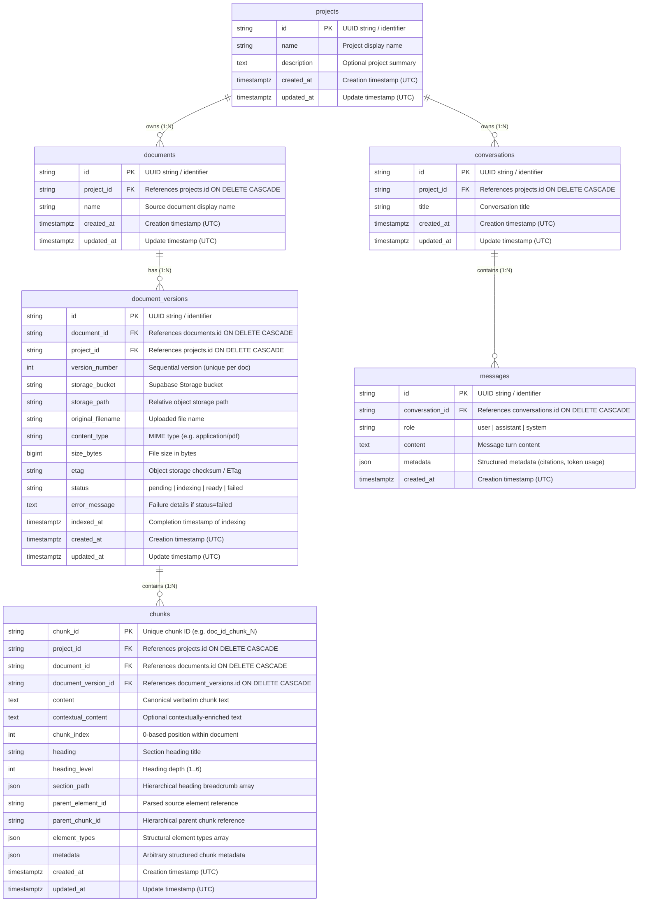

# Database Architecture

## 1. Overview

The AI Agent backend relies on **PostgreSQL** as its authoritative primary relational database and content store, with **SQLAlchemy 2.0 (async)** serving as the Object-Relational Mapping (ORM) layer and **Alembic** managing version-controlled database migrations.

The backend adheres strictly to a three-tier specialized storage architecture where each storage technology has a single, unambiguous responsibility:

```
┌─────────────────────────────────────────────────────────────┐
│                      Storage Topology                       │
└─────────────────────────────────────────────────────────────┘

       Supabase Storage
              │
              ▼
   [ Original Uploaded Files ]
   (Raw PDFs, DOCX, TXT, etc.)
              │
              │ Ingestion & Chunking
              ▼
          PostgreSQL
   (Authoritative Content Store & App DB)
   ├── Projects (Root Tenant Boundary)
   ├── Documents (Sources)
   ├── Document Versions (File Versions & Indexing State)
   ├── Chunks (Verbatim & Contextual Text, Structural Hierarchy)
   ├── Conversations (Chat Sessions)
   └── Messages (Append-only Turns & Metadata)
              │
              │ Dual Vector & Keyword Indexing
              ▼
            Qdrant
   (High-Performance Vector Index)
   ├── Dense Vectors (embeddings)
   ├── Sparse Vectors (BM25/SPLADE lexical representations)
   ├── Retrieval-Oriented Payload (filtering attributes)
   └── Stable RFC 4122 v5 UUID Point Identifiers
```

- **Supabase Storage**: Authoritative for raw, original file bytes. Files are uploaded directly to dedicated tenant storage paths and never stored as byte arrays in the relational database.
- **PostgreSQL**: Authoritative single source of truth for all structured application entities, relational hierarchies, tenant ownership, indexing lifecycle state, conversation history, and the complete canonical chunk text and metadata (the Content Store).
- **Qdrant**: Ephemeral and search-optimized vector database housing dense embeddings, sparse lexical vectors, and lightweight filtering payloads. Qdrant references PostgreSQL records via deterministic UUID point IDs and is never treated as the authoritative store for chunk text.

---

## 2. Database Technology

- **Database Management System**: PostgreSQL (version 15+ recommended)
- **Database Driver**: `asyncpg` (high-performance asynchronous PostgreSQL client library for Python/asyncio)
- **ORM**: SQLAlchemy 2.0 (using `DeclarativeBase`, `Mapped`, `mapped_column`, and modern 2.0 typed relationship constructs)
- **Engine Architecture**: Asynchronous singleton engine (`AsyncEngine`) configured via `create_async_engine()` in `backend/src/db/session.py`:
  - Connection scheme normalization: automatically maps `postgresql://` and `postgres://` connection strings to `postgresql+asyncpg://`
  - Connection pooling: `QueuePool` with pool size `5`, maximum overflow `10`, timeout `30s`, pre-ping health checks (`pool_pre_ping=True`), and connection recycle every `3600s`
- **Session Management**: `async_sessionmaker` producing non-expiring, non-autoflushing `AsyncSession` instances, yielded per-request via FastAPI dependency `get_db_session()`
- **Schema Migrations**: Alembic configured with an async engine runner in `backend/alembic/env.py` and sequential, timestamped revision scripts in `backend/alembic/versions/`

---

## 3. Entity Relationship Model



---

## 4. Tables

### Table: `projects`
- **Purpose**: Defines the root tenant isolation boundary. All documents, versions, chunks, and conversations belong to a project.
- **Primary Key**: `id` (`VARCHAR(255)`)
- **Delete/Cascade Behavior**: Deleting a project cascades in PostgreSQL and deletes all associated `documents`, `document_versions`, `chunks`, `conversations`, and `messages`.

| Column | Type | Nullable | Default | Key/Constraint | Description |
|---|---|---|---|---|---|
| `id` | `VARCHAR(255)` | No | Python UUID | PK | Unique project identifier |
| `name` | `VARCHAR(255)` | No | - | - | User-facing project name |
| `description` | `TEXT` | Yes | `NULL` | - | Optional project description |
| `created_at` | `TIMESTAMPTZ` | Yes | `now() (UTC)` | - | Creation timestamp with timezone |
| `updated_at` | `TIMESTAMPTZ` | Yes | `now() (UTC)` | - | Last modification timestamp with timezone |

---

### Table: `documents`
- **Purpose**: Represents a persistent user-facing source document within a project.
- **Primary Key**: `id` (`VARCHAR(255)`)
- **Foreign Keys**: `project_id` -> `projects.id` (`ON DELETE CASCADE`)
- **Indexes**:
  - `ix_documents_project_id` on `("project_id")`
  - `ix_documents_project_id_created_at` on `("project_id", "created_at")`

| Column | Type | Nullable | Default | Key/Constraint | Description |
|---|---|---|---|---|---|
| `id` | `VARCHAR(255)` | No | Python UUID | PK | Unique document identifier |
| `project_id` | `VARCHAR(255)` | No | - | FK -> `projects.id` | Owning project boundary |
| `name` | `VARCHAR(255)` | No | - | - | Source display name |
| `created_at` | `TIMESTAMPTZ` | Yes | `now() (UTC)` | - | Creation timestamp with timezone |
| `updated_at` | `TIMESTAMPTZ` | Yes | `now() (UTC)` | - | Last modification timestamp with timezone |

---

### Table: `document_versions`
- **Purpose**: Represents a concrete physical uploaded file version of a source document, tracking its object storage coordinates, file attributes, and indexing lifecycle state.
- **Primary Key**: `id` (`VARCHAR(255)`)
- **Foreign Keys**:
  - `document_id` -> `documents.id` (`ON DELETE CASCADE`)
  - `project_id` -> `projects.id` (`ON DELETE CASCADE`)
- **Unique Constraints**:
  - `uq_document_versions_document_id_version_number` on `("document_id", "version_number")`
- **Indexes**:
  - `ix_document_versions_document_id` on `("document_id")`
  - `ix_document_versions_project_id` on `("project_id")`
  - `ix_document_versions_status` on `("status")`
  - `ix_document_versions_project_id_document_id` on `("project_id", "document_id")`

| Column | Type | Nullable | Default | Key/Constraint | Description |
|---|---|---|---|---|---|
| `id` | `VARCHAR(255)` | No | Python UUID | PK | Unique document version identifier |
| `document_id` | `VARCHAR(255)` | No | - | FK -> `documents.id` | Owning logical document |
| `project_id` | `VARCHAR(255)` | No | - | FK -> `projects.id` | Owning project isolation boundary |
| `version_number` | `INTEGER` | No | `1` | Part of UQ | Sequential 1-based version number |
| `storage_bucket` | `VARCHAR(255)` | No | - | - | Supabase Storage bucket name |
| `storage_path` | `VARCHAR(1024)` | No | - | - | Path within storage bucket |
| `original_filename` | `VARCHAR(512)` | No | - | - | Original uploaded file name |
| `content_type` | `VARCHAR(255)` | Yes | `NULL` | - | Canonical MIME type (e.g. `application/pdf`) |
| `size_bytes` | `BIGINT` | Yes | `NULL` | - | Physical file size in bytes |
| `etag` | `VARCHAR(255)` | Yes | `NULL` | - | Storage provider checksum/ETag |
| `status` | `VARCHAR(50)` | No | `'pending'` | Indexed | Lifecycle state: pending, indexing, ready, failed |
| `error_message` | `TEXT` | Yes | `NULL` | - | Error details when status is failed |
| `indexed_at` | `TIMESTAMPTZ` | Yes | `NULL` | - | Timestamp when indexing succeeded |
| `created_at` | `TIMESTAMPTZ` | Yes | `now() (UTC)` | - | Creation timestamp with timezone |
| `updated_at` | `TIMESTAMPTZ` | Yes | `now() (UTC)` | - | Last modification timestamp with timezone |

---

### Table: `chunks`
- **Purpose**: Authoritative Content Store for all parsed and enriched document chunks. Consumed by RAG Chunk Hydration, Context Assembly, and evaluation stages.
- **Primary Key**: `chunk_id` (`VARCHAR(255)`)
- **Foreign Keys**:
  - `project_id` -> `projects.id` (`ON DELETE CASCADE`)
  - `document_id` -> `documents.id` (`ON DELETE CASCADE`)
  - `document_version_id` -> `document_versions.id` (`ON DELETE CASCADE`, nullable for legacy compatibility)
- **Indexes**:
  - `ix_chunks_project_id` on `("project_id")`
  - `ix_chunks_document_id` on `("document_id")`
  - `ix_chunks_document_version_id` on `("document_version_id")`
  - `ix_chunks_project_id_chunk_id` on `("project_id", "chunk_id")`
  - `ix_chunks_project_id_document_id` on `("project_id", "document_id")`

| Column | Type | Nullable | Default | Key/Constraint | Description |
|---|---|---|---|---|---|
| `chunk_id` | `VARCHAR(255)` | No | - | PK | Unique deterministic chunk ID (e.g. `doc_id_chunk_0`) |
| `project_id` | `VARCHAR(255)` | No | - | FK -> `projects.id` | Owning project boundary |
| `document_id` | `VARCHAR(255)` | No | - | FK -> `documents.id` | Owning document boundary |
| `document_version_id` | `VARCHAR(255)` | Yes | `NULL` | FK -> `document_versions.id` | Owning document version |
| `content` | `TEXT` | No | - | - | Verbatim extracted chunk text |
| `contextual_content` | `TEXT` | Yes | `NULL` | - | Contextually-enriched chunk text representation |
| `chunk_index` | `INTEGER` | No | `0` | - | Positional index within document sequence |
| `heading` | `VARCHAR(512)` | Yes | `NULL` | - | Nearest enclosing heading title |
| `heading_level` | `INTEGER` | Yes | `NULL` | - | Heading depth level (e.g. 1, 2, 3) |
| `section_path` | `JSON` | Yes | `[]` | - | List of breadcrumb heading strings |
| `parent_element_id` | `VARCHAR(255)` | Yes | `NULL` | - | Source parsed element ID |
| `parent_chunk_id` | `VARCHAR(255)` | Yes | `NULL` | - | Parent chunk ID for hierarchical chunking |
| `element_types` | `JSON` | Yes | `[]` | - | List of parsed element types in chunk |
| `metadata` | `JSON` | Yes | `{}` | - | Arbitrary enriched structured metadata |
| `created_at` | `TIMESTAMPTZ` | Yes | `now() (UTC)` | - | Creation timestamp with timezone |
| `updated_at` | `TIMESTAMPTZ` | Yes | `now() (UTC)` | - | Last modification timestamp with timezone |

---

### Table: `conversations`
- **Purpose**: Represents a chat conversation session belonging to a specific project.
- **Primary Key**: `id` (`VARCHAR(255)`)
- **Foreign Keys**: `project_id` -> `projects.id` (`ON DELETE CASCADE`)
- **Indexes**:
  - `ix_conversations_project_id` on `("project_id")`
  - `ix_conversations_project_id_updated_at` on `("project_id", "updated_at")`

| Column | Type | Nullable | Default | Key/Constraint | Description |
|---|---|---|---|---|---|
| `id` | `VARCHAR(255)` | No | Python UUID | PK | Unique conversation identifier |
| `project_id` | `VARCHAR(255)` | No | - | FK -> `projects.id` | Owning project boundary |
| `title` | `VARCHAR(255)` | Yes | `'New Conversation'` | - | User-facing conversation title |
| `created_at` | `TIMESTAMPTZ` | Yes | `now() (UTC)` | - | Creation timestamp with timezone |
| `updated_at` | `TIMESTAMPTZ` | Yes | `now() (UTC)` | - | Last activity timestamp with timezone |

---

### Table: `messages`
- **Purpose**: Represents an individual conversational turn (user prompt, assistant response, system prompt) within a conversation.
- **Primary Key**: `id` (`VARCHAR(255)`)
- **Foreign Keys**: `conversation_id` -> `conversations.id` (`ON DELETE CASCADE`)
- **Indexes**:
  - `ix_messages_conversation_id` on `("conversation_id")`
  - `ix_messages_conversation_id_created_at` on `("conversation_id", "created_at")`

| Column | Type | Nullable | Default | Key/Constraint | Description |
|---|---|---|---|---|---|
| `id` | `VARCHAR(255)` | No | Python UUID | PK | Unique message turn identifier |
| `conversation_id` | `VARCHAR(255)` | No | - | FK -> `conversations.id` | Owning conversation session |
| `role` | `VARCHAR(50)` | No | - | - | Turn role: `'user'`, `'assistant'`, or `'system'` |
| `content` | `TEXT` | No | - | - | Message textual content |
| `metadata` | `JSON` | Yes | `{}` | - | Structured metadata (citations, token counts) |
| `created_at` | `TIMESTAMPTZ` | Yes | `now() (UTC)` | - | Creation timestamp with timezone |

---

## 5. Project Model

- **Identity**: `ProjectModel` represents the top-level tenant and administrative boundary. All resources in the platform are strictly project-scoped.
- **Ownership**: A project owns zero or more `DocumentModel` instances and zero or more `ConversationModel` instances.
- **Isolation Implications**: Queries for documents, versions, chunks, and conversations should always be constrained by `project_id`. Multi-tenant leaks are prevented by foreign key cascades and required project boundaries.
- **Deletion Behavior**: When a project is deleted in PostgreSQL, foreign keys defined with `ON DELETE CASCADE` ensure that all related documents, document versions, chunks, conversations, and messages are deleted immediately in the database.
- *Note on External Resources*: PostgreSQL cascades do not delete physical files in Supabase Storage or vector points in Qdrant; application services handle external resource teardown during project deletion workflows.

---

## 6. Document / Source Model

- **Product Concept vs. Database Model**: In the product and UI, uploaded assets are referred to as "Sources". In the database, the persistent entity is named `DocumentModel` (table: `documents`) to align with existing RAG conventions (`document_id`).
- **Separation from Physical Files**: A `DocumentModel` represents the identity of a source (e.g. "Employee Handbook.pdf"). It does not represent a specific physical binary file or byte stream.
- **Relationship to Versions**: Every document has one or more `DocumentVersionModel` records representing physical file revisions. When a user updates or re-uploads a source, a new `DocumentVersionModel` is created under the same document.

---

## 7. Document Version Model

- **Why Versions Are Separate**: A source document may be revised, re-uploaded, or re-indexed over time. Separating `DocumentVersionModel` from `DocumentModel` enables immutable indexing runs, version history, and zero-downtime re-indexing.
- **Storage Coordinates**: Points directly to Supabase Storage via `storage_bucket` and `storage_path`.
- **File Attributes**: Stores `original_filename`, `content_type`, `size_bytes`, and `etag`.
- **Version Numbering**: An integer `version_number` starts at 1 and is constrained by a composite unique constraint `(document_id, version_number)`.
- **Relationship to Chunks**: Chunks generated by the ingestion pipeline are linked to the specific `DocumentVersionModel` that produced them.

---

## 8. Chunk Content Store

PostgreSQL serves as the authoritative, durable **Content Store** for RAG retrieval operations:

1. **Canonical Content**: The verbatim text of every chunk resides in `chunks.content`.
2. **Contextual Enrichment**: If contextual enrichment is enabled during indexing, the augmented text (with document/section context) is stored in `chunks.contextual_content`.
3. **Structural Hierarchy**: Heading titles (`heading`), levels (`heading_level`), breadcrumb paths (`section_path`), and parent-child links (`parent_chunk_id`, `parent_element_id`) are preserved for structure-aware Context Assembly.
4. **Authoritative vs. Ephemeral Coordinates**:
   - **PostgreSQL Chunk (`ChunkModel`)**: Authoritative text, structural hierarchy, and metadata.
   - **Qdrant Vector Point**: Generated point ID (`RFC 4122 v5 UUID` seeded deterministically by `project_id`, `document_id`, `document_version_id`, and `chunk_id`), holding embedding vectors and filtering payloads.
5. **Chunk Hydration Stage**: During retrieval, candidate point IDs returned from Qdrant dense/sparse vector search and reranking are resolved in a single batched lookup against PostgreSQL `chunks`, guaranteeing that the LLM always receives authentic, uncorrupted content.

---

## 9. Conversation Model

- **Project Scoping**: A conversation belongs to exactly one project (`project_id`).
- **Lifecycle**: Represents a continuous thread of user-agent interactions.
- **Title**: A human-readable title (`title`), defaulting to `"New Conversation"`.
- **Ordering**: Indexed on `(project_id, updated_at)` to support listing conversations ordered by most recent activity.

---

## 10. Message Model

- **Conversation Relationship**: Every message belongs to a single conversation (`conversation_id`).
- **Roles**: Standard message roles are supported: `'user'`, `'assistant'`, `'system'`.
- **Metadata**: Stores response metadata such as chunk citation IDs, model tokens, execution latency, and groundedness confidence scores.
- **Immutability**: Messages are append-only conversational turns ordered by `created_at`.
- **What is NOT stored**: Full chunk texts, embedding vectors, and raw LLM prompt templates are intentionally excluded from messages to prevent data redundancy.

---

## 11. Relationships and Ownership

| Parent | Child | Cardinality | Database FK Cascade | ORM Relationship Cascade |
|---|---|---|---|---|
| `ProjectModel` | `DocumentModel` | 1 : N | `ON DELETE CASCADE` | `all, delete-orphan` |
| `DocumentModel` | `DocumentVersionModel` | 1 : N | `ON DELETE CASCADE` | `all, delete-orphan` |
| `DocumentVersionModel` | `ChunkModel` | 1 : N | `ON DELETE CASCADE` | `all, delete-orphan` |
| `ProjectModel` | `ConversationModel` | 1 : N | `ON DELETE CASCADE` | `all, delete-orphan` |
| `ConversationModel` | `MessageModel` | 1 : N | `ON DELETE CASCADE` | `all, delete-orphan` |

---

## 12. Indexes and Constraints

### Unique Constraints
- `uq_document_versions_document_id_version_number` on `document_versions(document_id, version_number)`: Enforces unique version numbering per source document.

### Performance & Filtering Indexes
- `ix_documents_project_id` & `ix_documents_project_id_created_at`: Efficient project-scoped document listings sorted by creation date.
- `ix_document_versions_document_id` & `ix_document_versions_project_id`: Fast version lookups by document or project.
- `ix_document_versions_status`: Efficient querying of documents currently in `pending`, `indexing`, or `failed` states.
- `ix_document_versions_project_id_document_id`: Fast compound lookups for document-specific version queries within a project.
- `ix_chunks_project_id`, `ix_chunks_document_id`, `ix_chunks_document_version_id`: High-speed tenant and document-level chunk filtering.
- `ix_chunks_project_id_chunk_id`: Primary batched Chunk Hydration query index (`WHERE project_id = :p AND chunk_id IN (:ids)`).
- `ix_chunks_project_id_document_id`: Context Assembly index for document-wide chunk traversal.
- `ix_conversations_project_id` & `ix_conversations_project_id_updated_at`: Fast project-scoped conversation history retrieval sorted by recent activity.
- `ix_messages_conversation_id` & `ix_messages_conversation_id_created_at`: High-speed chronological turn loading for chat interfaces.

---

## 13. Project Isolation

Tenant boundary isolation is enforced through relational hierarchy:
1. Every domain table (`documents`, `document_versions`, `chunks`, `conversations`) explicitly references `project_id`.
2. Foreign key constraints ensure child entities cannot reference a non-existent project.
3. Message ownership is transitively bound through `conversation_id -> conversations.project_id`, eliminating redundant column synchronization while preserving strict project ownership.
4. Composite indexes pair `project_id` with secondary filter fields to ensure database query execution plans never perform full table scans across tenants.

---

## 14. Storage Architecture

| Data Type | Storage System | Authority Level | Lifecycle & Retention |
|---|---|---|---|
| Original Source Files | Supabase Storage | Authoritative | Retained until Document or Version is deleted |
| Projects & Tenants | PostgreSQL | Authoritative | Persistent relational record |
| Documents & Versions | PostgreSQL | Authoritative | Persistent relational record |
| Processing Status & Logs | PostgreSQL | Authoritative | Updated during indexing lifecycle |
| Canonical Chunk Text | PostgreSQL | Authoritative | Persistent Content Store |
| Chunk Structural Hierarchy | PostgreSQL | Authoritative | Breadcrumbs, headings, element types |
| Conversations & Messages | PostgreSQL | Authoritative | Persistent chat history |
| Dense & Sparse Embeddings | Qdrant | Ephemeral / Index | Re-creatable from PostgreSQL chunks |
| Vector Retrieval Payload | Qdrant | Index Cache | Synced during indexing runs |

---

## 15. Indexing Lifecycle

`DocumentVersionModel.status` tracks the asynchronous indexing state of a file version:

- **`pending`**: File has been uploaded to Supabase Storage; record created; awaiting pipeline execution.
- **`indexing`**: Ingestion, parsing, cleaning, chunking, enrichment, and dual vector indexing are actively running.
- **`ready`**: Pipeline completed successfully; chunks are saved in PostgreSQL; vectors are indexed in Qdrant; document is fully searchable.
- **`failed`**: An unrecoverable error occurred during processing; `error_message` contains details of the failure.

*Note*: Background workers, job queues (e.g. Celery, ARQ), and trigger mechanisms are managed in application services and are decoupled from the schema definition.

---

## 16. Migration Architecture

The database migration chain is managed via Alembic:

- **Revision Chain**:
  1. `20260914_0001` (`create_chunks_table.py`): Initial creation of the `chunks` Content Store table.
  2. `20260914_0002` (`create_application_tables.py`): Creates `projects`, `documents`, `document_versions`, `conversations`, and `messages` tables, establishes foreign keys on `chunks`, and configures compound indexes and unique constraints.
- **Downgrade Safety**: The migration provides a clean `downgrade()` function that drops constraints from `chunks` and drops application tables in safe dependency reverse order without dropping `chunks`.
- **Auto-Discovery**: `alembic/env.py` imports `models` to ensure all declarative entities are automatically registered with `Base.metadata`.

---

## 17. Database Access Architecture

- **Session Injection**: Application routers and services receive an active `AsyncSession` using the FastAPI dependency `get_db_session()` in `backend/src/db/session.py`.
- **Transaction Boundary**: `get_db_session()` automatically commits on normal block exit and triggers an asynchronous rollback if an exception is raised.
- **Query Execution**: Services utilize SQLAlchemy 2.0 select statements (`select(Model).where(...)`) with async execution (`await session.execute(...)`).

---

## 18. What Is NOT in the Database

To keep the application foundation clean and focused, the following concepts are intentionally **omitted** at this stage:

- **Users and Authentication**: No `users`, `accounts`, or `passwords` tables exist; project isolation is tenant-based.
- **Project Memberships & Permissions**: No RBAC, roles, or organization tables.
- **Persistent Agent Entities**: Agents are currently stateless execution pipelines, not database entities.
- **Chat Attachments Table**: Files are linked via source documents, not arbitrary chat attachment tables.
- **Vector Embeddings**: Vector arrays and sparse token dictionaries are stored exclusively in Qdrant, never in PostgreSQL.
- **Original File Bytes**: No BLOB / BYTEA columns exist in PostgreSQL; original files reside in Supabase Storage.

---

## 19. Design Principles

1. **PostgreSQL as Authoritative Source of Truth**: All structured data, relationships, chunk texts, and chat histories are authoritatively held in PostgreSQL.
2. **Specialized Three-Storage Architecture**: Files in Supabase Storage, relational & content in PostgreSQL, vectors in Qdrant.
3. **Normalized Ownership**: Clear, single-direction parent-child hierarchies with cascading referential integrity.
4. **Strict Tenant Boundaries**: Mandatory project scoping across all application and retrieval entities.
5. **Stable RFC 4122 v5 Identifiers**: Deterministic point IDs bridge PostgreSQL chunks and Qdrant points across re-indexing runs.
6. **Zero-Downtime Migration Trail**: Clean, linear Alembic migration history with bi-directional upgrade and downgrade support.

---

## 20. Future Extension Points

The schema is structured to accommodate future enhancements without breaking changes:

- **Users and Organization Access**: An `organizations` or `users` table can reference `projects` via foreign keys or a `project_memberships` association table.
- **Persistent Agent Sessions**: An `agents` table can link to `conversations` to allow multi-agent or agent-specific chat histories.
- **Document Chunk Version Diffing**: Version-to-version chunk diffing can be performed using `document_version_id` on `ChunkModel`.
- **Audit Trails**: An `audit_logs` table can capture modification events keyed by `project_id`.
