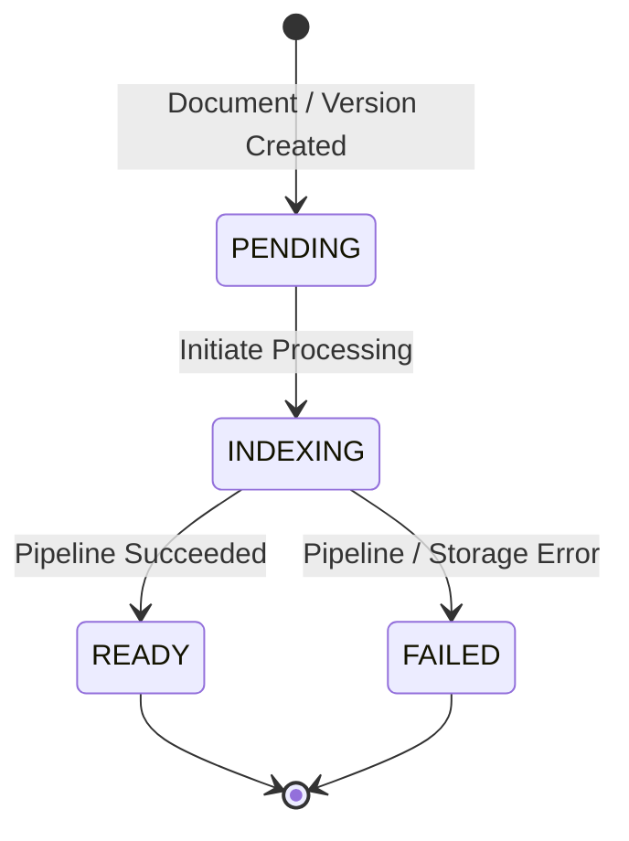

# Document Processing Lifecycle

## 1. Overview & Objective

The **Document Processing Lifecycle** manages the transition of a physical `DocumentVersion` through processing toward indexing readiness.

In our RAG-backed application architecture, a strict separation of concerns exists across three key layers:

```
┌──────────────────────────────────────────────────────────┐
│             Project & Document Management                │
│             "What the source document is"                │
│  - Project CRUD & strict tenant boundaries               │
│  - User-facing Document logical entity                   │
│  - DocumentVersion registration & Supabase Storage upload│
└────────────────────────────┬─────────────────────────────┘
                             │ DocumentVersion created
                             ▼
┌──────────────────────────────────────────────────────────┐
│             Document Processing Lifecycle                │
│           (This Subsystem - Current Scope)               │
│  - Processing initiation & trigger boundary              │
│  - DocumentVersion as unit of processing                 │
│  - Deterministic state machine (PENDING/INDEXING/READY)  │
│  - Invalid transition & duplicate processing protection  │
│  - Relational ownership & storage source validation      │
│  - Failure handling & sanitized error persistence        │
│  - Decoupled RAG Pipeline Interface                      │
└────────────────────────────┬─────────────────────────────┘
                             │ BaseDocumentProcessingPipeline
                             ▼
┌──────────────────────────────────────────────────────────┐
│                 End-to-End Indexing                      │
│            (Next Phase Implementation)                   │
│  - Acquisition -> Ingestion -> Parsing -> Cleaning       │
│  - Normalization -> Chunking -> Metadata Enrichment      │
│  - Contextual Enrichment -> Dense/Sparse Embeddings      │
│  - PostgreSQL Chunk Storage + Qdrant Vector Upsert       │
└──────────────────────────────────────────────────────────┘
```

---

## 2. DocumentVersion as the Unit of Processing

In the application data model:
- `Project`: Defines tenant isolation boundary.
- `Document`: Represents the persistent logical source file.
- `DocumentVersion`: Represents an immutable physical revision with specific object storage coordinates (`storage_bucket`, `storage_path`, `original_filename`, `content_type`, `size_bytes`, `etag`).

**The lifecycle operates strictly on `document_version_id` while preserving `project_id` and `document_id`.**

### Version Isolation

Each `DocumentVersion` is processed independently:
- If Document `D1` has Version `V1` in `ready` state, uploading Version `V2` initiates processing on `V2` (`pending` → `indexing`).
- Processing `V2` does not mutate, overwrite, or corrupt the state or history of `V1`.
- Logical document identity remains stable throughout all versions.

---

## 3. Processing State Machine

The lifecycle uses the authoritative `status` column on `DocumentVersionModel` in PostgreSQL:

| State | Enum / Value | Description |
| :--- | :--- | :--- |
| **PENDING** | `pending` | Initial state upon file upload and DB registration. Awaiting processing. |
| **INDEXING** | `indexing` | Processing is actively executing through the pipeline boundary. |
| **READY** | `ready` | Pipeline processing succeeded. `indexed_at` timestamp recorded. Searchable. |
| **FAILED** | `failed` | Processing encountered an error. Sanitized `error_message` persisted. |

### State Transitions



#### Valid Transitions
- `PENDING → INDEXING`: Normal processing initiation.
- `INDEXING → READY`: Successful completion of all pipeline stages.
- `INDEXING → FAILED`: Handled failure during pipeline execution or storage validation.

#### Disallowed / Rejected Transitions
- `READY → INDEXING`: Rejected (`InvalidDocumentStateTransitionError`). Reprocessing policy is not yet finalized.
- `INDEXING → INDEXING`: Rejected (`DocumentAlreadyProcessingError`). Protects against duplicate concurrent processing.
- `PENDING → READY`: Rejected. Cannot bypass processing pipeline.
- `FAILED → INDEXING`: Rejected. Retries are not auto-triggered in this prototype phase.

---

## 4. Transaction Boundaries & Non-Blocking Architecture

To avoid holding open long-lived PostgreSQL database transactions while external CPU-bound or network-bound RAG processing occurs:

1. **Transaction 1 (Initiation)**:
   - Queries `DocumentVersionModel` with row-level lock (`SELECT ... FOR UPDATE`).
   - Validates relational ownership and storage coordinates.
   - Enforces transition from `pending` to `indexing`.
   - Clears any previous `error_message`.
   - Commits transaction immediately.
2. **Pipeline Execution (Decoupled)**:
   - Invokes `BaseDocumentProcessingPipeline.process_document_version(...)`.
   - Runs independently without holding open database locks or connections.
3. **Transaction 2 (Completion / Failure)**:
   - Re-acquires the version record.
   - If successful: transitions from `indexing` to `ready`, sets `indexed_at = now(utc)`.
   - If failed: transitions from `indexing` to `failed`, sets sanitized `error_message`.
   - Commits transaction immediately.

---

## 5. Failure Handling & Error Sanitization

When processing fails at any point:
1. The error is captured at the service boundary.
2. State is transitioned strictly to `FAILED` (never `READY`).
3. Sensitive credentials (passwords in database URLs, OpenAI keys, Supabase tokens) are sanitized via `sanitize_error_message` before persistence into `document_versions.error_message`.
4. Detailed diagnostic logs are emitted including `project_id`, `document_id`, and `document_version_id`.
5. A domain `DocumentProcessingError` is raised with the sanitized message and original exception reference.

---

## 6. Storage & Source Validation

Before processing enters the pipeline, the lifecycle verifies:
- `storage_bucket` is present and non-empty.
- `storage_path` is present and non-empty.
- `original_filename` is present and non-empty.

If storage information is missing:
- State transitions to `FAILED`.
- `error_message` is recorded in PostgreSQL.
- `DocumentStorageSourceError` is raised.

---

## 7. RAG Pipeline Boundary Interface

The lifecycle integrates with RAG capabilities through `BaseDocumentProcessingPipeline`:

```python
class BaseDocumentProcessingPipeline(ABC):
    @abstractmethod
    async def process_document_version(
        self,
        project_id: str,
        document_id: str,
        document_version_id: str,
        storage_bucket: str,
        storage_path: str,
        original_filename: str,
        content_type: Optional[str] = None,
    ) -> Any:
        """Process document version through RAG stages."""
```

The lifecycle has no knowledge of internal RAG implementation details (e.g. Voyage AI tokens, Qdrant vectors, chunking character limits). It communicates exclusively through this interface.

In the next phase, the **End-to-End Indexing** engine will implement this interface to connect:
`Acquisition` → `Ingestion` → `Parsing` → `Cleaning` → `Normalization` → `Chunking` → `Metadata Enrichment` → `Contextual Enrichment` → `Embeddings / Sparse Representations` → `PostgreSQL Chunk Store + Qdrant Indexing`.

---

## 8. Automatic Processing & Trigger Modes

`DocumentProcessingService` provides two trigger mechanisms:

1. **Synchronous Execution**:
   ```python
   version = await service.process_document_version(project_id, document_id, version_id)
   ```
2. **Background Execution**:
   ```python
   task = await service.trigger_processing(project_id, document_id, version_id, background=True)
   ```

### Configuration
- Application setting: `AUTO_PROCESS_DOCUMENTS: bool = False` (default).
- When enabled in production, `DocumentService.create_document` and `create_document_version` automatically trigger processing upon upload.
- When disabled, newly uploaded versions remain in `pending` awaiting explicit triggering.

---

## 9. Non-Responsibilities

The Document Processing Lifecycle strictly does **NOT** own:
- RAG stage implementations (parsing, cleaning, chunking, embeddings, Qdrant indexing).
- DeepAgents, LangGraph, agent memory, or sub-agent orchestration.
- Query transformation, reranking, or retrieval execution.
- LLM generation or prompt assembly.
- Distributed queues, Celery, or Kafka infrastructure.
